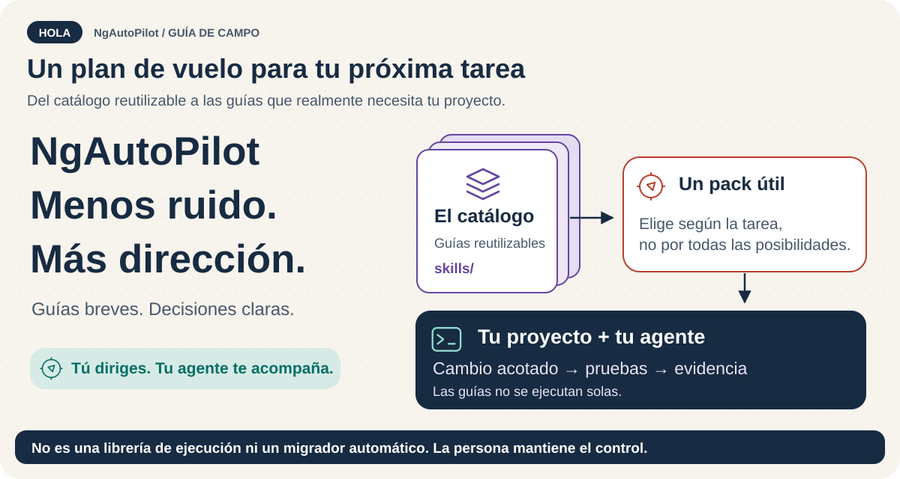
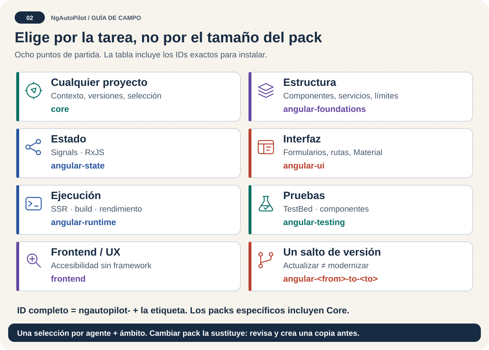
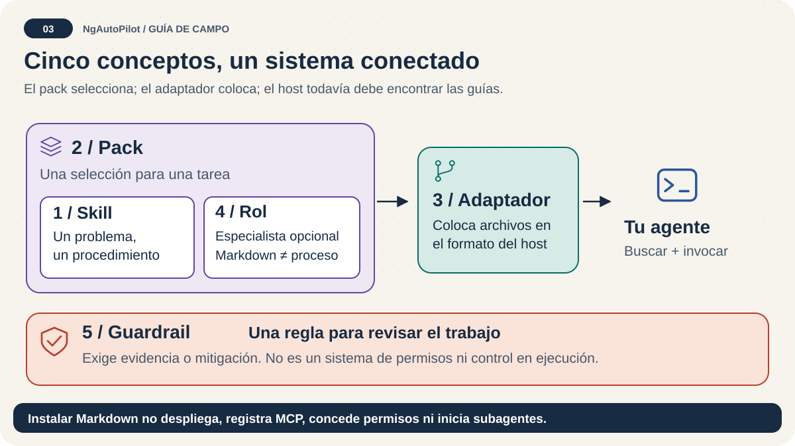
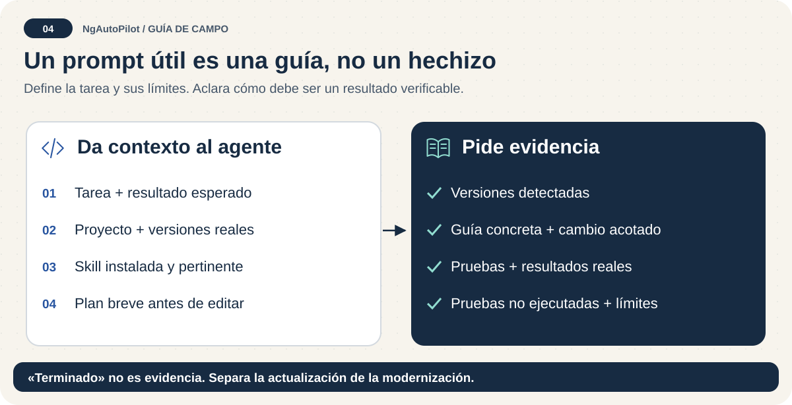
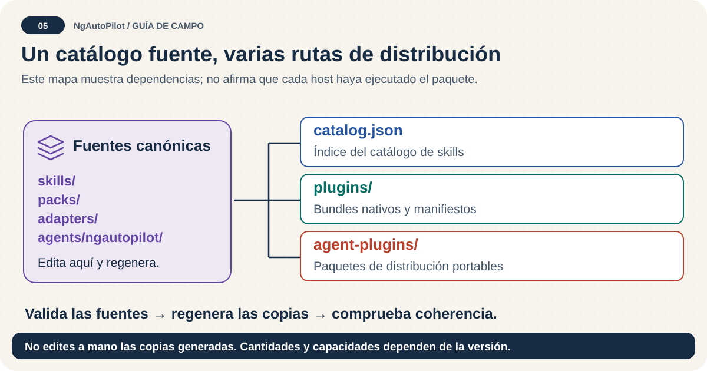

# NgAutoPilot 🚀

[English](README.md) · [Español](README.es.md) · [Mapa de documentación](docs/README.es.md)

**Dale a tu agente una ruta, no una montaña de instrucciones.**

NgAutoPilot es una herramienta de línea de comandos (CLI) y un catálogo de pequeñas guías de ingeniería (*skills*). Ayuda al agente a inspeccionar el proyecto, detectar versiones, elegir la guía adecuada, realizar un cambio acotado y validar el resultado. No es una biblioteca que se ejecute dentro de Angular ni un migrador automático de código.



## 🧭 Primera ejecución


Para este checkout necesitas **Node.js >= 24.0.0 y < 25**, npm, un agente compatible y un proyecto receptor. Comprueba los requisitos de la versión del paquete que instales.

Ejecuta estos comandos **dentro del proyecto receptor**, no dentro de este catálogo:

```bash
npm exec --package=ngautopilot -- ngautopilot adapters
npm exec --package=ngautopilot -- ngautopilot packs
npm exec --package=ngautopilot -- ngautopilot install --agent codex --pack ngautopilot-angular-foundations --scope project --dry-run
```

1. **Elige:** sustituye Codex y el pack de fundamentos por los identificadores que muestran los primeros comandos.
2. **Inspecciona:** `--dry-run` muestra el plan sin escribir. Revisa rutas y conflictos.
3. **Aprueba y verifica:** después de revisar el plan, ejecuta:

```bash
npm exec --package=ngautopilot -- ngautopilot install --agent codex --pack ngautopilot-angular-foundations --scope project --yes
npm exec --package=ngautopilot -- ngautopilot verify --agent codex --scope project
```

Con Codex, las skills quedan en `.agents/skills/`, las instrucciones gestionadas en el archivo raíz `AGENTS.md` y el manifiesto `.ngautopilot-manifest.json` en la raíz de instalación seleccionada. La verificación comprueba archivos y sumas de comprobación; **no** demuestra que el agente haya descubierto las skills. Abre el agente en el proyecto receptor y pídele que identifique la skill aplicable antes de editar.

> **Punto de control de versión:** `npm exec` utiliza un paquete publicado, no este checkout. Fija una versión publicada exacta y verificada para automatizaciones reproducibles. Comprueba los comandos propios de una rama con `node bin/ngautopilot.mjs help` dentro de este repositorio; no supongas que código sin integrar ya está en npm.

**Siguiente paso:** [primera tarea Angular](docs/first-angular-project.es.md) · [instalación](docs/installation.es.md) · [solución de problemas](docs/troubleshooting.es.md).

## 🎒 Elige el pack para la tarea de hoy



| Tu tarea | Empieza con |
| --- | --- |
| Flujo básico, cualquier proyecto | `ngautopilot-core` |
| Arquitectura, componentes y servicios Angular | `ngautopilot-angular-foundations` |
| Signals y RxJS | `ngautopilot-angular-state` |
| Formularios, rutas, plantillas y Material | `ngautopilot-angular-ui` |
| SSR, compilación, rendimiento y seguridad | `ngautopilot-angular-runtime` |
| Pruebas Angular | `ngautopilot-angular-testing` |
| Accesibilidad y UX independientes del framework | `ngautopilot-frontend` |
| Un único salto de versión mayor Angular | `ngautopilot-angular-<from>-to-<to>` |

Los packs específicos incluyen Core mediante dependencias. Cambiar de pack para el mismo agente y ámbito **sustituye la selección gestionada**, en lugar de acumular todos los packs anteriores. Los archivos gestionados obsoletos sin cambios pueden eliminarse; los obsoletos modificados se conservan y notifican salvo que se fuerce. Los archivos todavía seleccionados pueden actualizarse aunque estén editados. Guarda tus personalizaciones e inspecciona cada cambio.

`ngautopilot-angular` y `ngautopilot-full` son opciones amplias deliberadas, no recomendaciones para principiantes. [Packs y saltos históricos](docs/packs.es.md).

## 🧩 Cinco conceptos útiles



| Concepto | Significado sencillo |
| --- | --- |
| Skill | Procedimiento para un problema de ingeniería |
| Pack | Selección de skills y recursos especializados opcionales |
| Adaptador | Distribución de archivos para tu agente |
| Rol de subagente | Definición Markdown de un especialista; no es un agente en ejecución |
| Guardrail | Regla de revisión que exige evidencia o mitigación; no impone controles durante la ejecución |

```text
Tu tarea → inspeccionar → detectar versiones → elegir guía → revisar riesgos
         → realizar un cambio pequeño → validar → comunicar evidencias
```


La animación decorativa dura 3,6 segundos, se reproduce una vez y respeta la preferencia de movimiento reducido. Todos los pasos siguen siendo legibles en una vista estática.

La persona dirige la tarea. Las skills orientan al agente. Las pruebas y la revisión demuestran el resultado. Instalar Markdown no concede permisos, despliega servicios, registra MCP ni inicia subagentes automáticamente.

## 💬 Prueba un mensaje útil



> Inspecciona las versiones de Angular, Node, TypeScript y RxJS del proyecto. Identifica la skill de NgAutoPilot instalada para rutas con carga diferida. Explica el cambio seguro más pequeño antes de editar y valida con las comprobaciones existentes del proyecto. Indica qué comprobaciones no pudiste ejecutar.

Para revisar pruebas, cambia la tarea por «revisar configuraciones frágiles de TestBed y comportamiento asíncrono». Para actualizar Angular, indica la versión actual y la siguiente, y separa la modernización.

**Un buen resultado incluye:** versiones detectadas, una skill aplicable identificada, un plan acotado y resultados reales de validación; no solo «terminado».

## 🔎 Catálogo y mapa del repositorio



Tamaño actual del catálogo: **413 skills**.

En este checkout, `doctor` muestra **36 packs y 10 adaptadores**. Ejecuta `doctor`, `packs` y `adapters` para tu versión instalada, en lugar de suponer que todas las versiones coinciden.

| Fuente | Responsabilidad |
| --- | --- |
| `skills/_core/` | Recepción, detección, selección, compatibilidad y riesgo |
| `skills/angular/versioning/` | Decisiones según la versión |
| `skills/angular/upgrades/` | Saltos de versión, incluido `skills/angular/upgrades/21-to-22/` |
| `skills/angular/modernization/` | Standalone, flujo de control, `@defer` y adopción zoneless después de estabilizar |
| `skills/angular/architecture/` | Límites y patrones de la aplicación |
| `skills/angular/microfrontends/` | Límites distribuidos del frontend |
| `skills/angular/docs/` | Decisiones arquitectónicas, informes y paquetes de revisión |
| `skills/frontend/`, `skills/css/` | Accesibilidad, UX, diseño, distribución visual y rendimiento |
| `skills/typescript/`, `skills/javascript/`, `skills/quality/` | Procedimientos transversales de lenguaje y calidad |

`skills/` es la fuente canónica. `catalog.json`, `plugins/` y `agent-plugins/` son distribuciones generadas; no edites sus copias manualmente. [Arquitectura](docs/ecosystem-architecture.es.md).

## 🛤️ Elige la distribución adecuada


| Ruta | Qué hace | Qué no demuestra |
| --- | --- | --- |
| CLI de NgAutoPilot | Packs específicos o perfiles Angular compatibles | Descubrimiento o ejecución en el cliente |
| `npx skills add janpereira-dev/ngAutoPilot` | Descubrimiento externo de skills individuales | Selección de packs; `skills.sh.json` solo afecta a la página |
| Manifiestos Claude/Codex | Descripciones de bundles nativos | Publicación, aprobación o compatibilidad universal |
| Agent Plugins Preview | Skills portables y MCP stdio separado de solo lectura | Instalación completa en todos los clientes |
| Metadatos Pi | Descubrimiento del paquete | Comportamiento verificado durante la ejecución |

Identificadores: `claude`, `codex`, `copilot`, `cursor`, `gemini`, `generic`, `hermes`, `openclaw`, `opencode`, `pi`. Nativo, adaptado, experimental y no verificado son estados distintos. [Matriz de instalación](docs/agent-installation-matrix.es.md).

El expediente OpenAI de esta rama contiene **solo skills**, **no se ha enviado** y **no está verificado por OpenAI**. Las declaraciones humanas siguen siendo acciones humanas. Esta rama tiene metadatos del futuro paquete; no anuncies `openai:validate` si no aparece en el `package.json` de esa versión. [Límites de publicación](docs/openai-marketplace-release.es.md).

## 📚 Elige el siguiente capítulo


| Quieres… | Consulta |
| --- | --- |
| Empezar sin conocer la terminología | [Primeros pasos](docs/getting-started.es.md) |
| Seguir un ejemplo de principio a fin | [Primer proyecto Angular](docs/first-angular-project.es.md) |
| Instalar, cambiar de pack, exportar o trabajar sin conexión | [Instalación](docs/installation.es.md) |
| Encontrar un comando exacto | [Referencia CLI](docs/cli-reference.es.md) |
| Entender la cobertura Angular | [Versiones](docs/angular-version-support.es.md), [mapa por etapas](docs/angular-version-era-map.es.md) |
| Mantener los archivos instalados | [Actualización](docs/updating.es.md), [desinstalación](docs/uninstalling.es.md) |
| Entender roles y reglas | [Roles](docs/agents-and-subagents.es.md), [prompts y guardrails](docs/prompts-and-guardrails.es.md) |
| Registrar el servidor MCP separado | [MCP y ChatGPT](docs/mcp-and-chatgpt.es.md) |
| Contribuir o publicar | [Contribución](CONTRIBUTING.es.md), [mantenimiento](docs/maintainer-guide.es.md), [lista de publicación](docs/release-checklist.es.md) |

**Todas las guías, registros históricos y estado de traducción:** [mapa en inglés](docs/README.md) · [mapa en español](docs/README.es.md).

## 🛠️ Punto de control para mantenimiento


Los cambios del catálogo usan el flujo existente:

```bash
npm run skills:validate
npm run skills:catalog
npm run plugins:sync
npm run agent-plugins:sync
npm run consistency:validate
```

La [lista de publicación](docs/release-checklist.es.md) cubre la validación y el empaquetado completos. Estos comandos pueden regenerar archivos: revisa los cambios. Las comprobaciones locales no demuestran publicación ni aprobación de revisión.

## Licencia y comunidad

MIT · [Licencia](LICENSE) · [Avisos de seguridad](SECURITY.es.md) · [Código de conducta](CODE_OF_CONDUCT.es.md) · [Historial](CHANGELOG.es.md) · [Hoja de ruta](ROADMAP.es.md)
