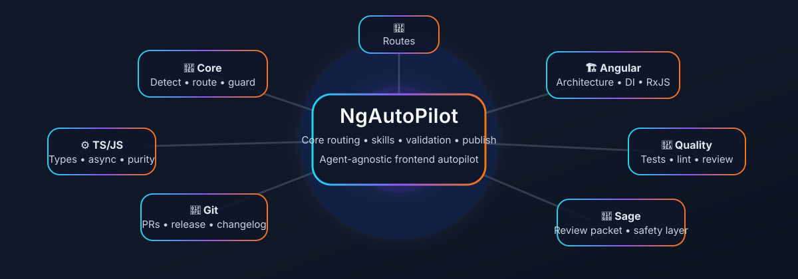
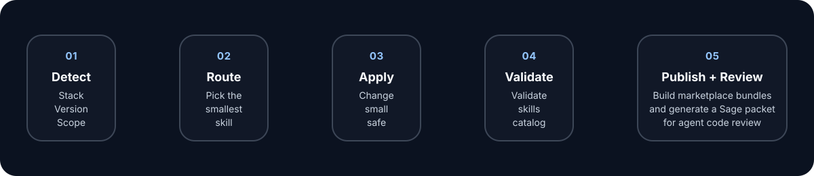

# NgAutoPilot

<p align="left">
  
</p>

NgAutoPilot is a public, agent-agnostic catalog of micro-skills for Angular, TypeScript, JavaScript, RxJS, testing, code quality, architecture, versioning, and quality governance workflows.

It helps AI agents make better technical decisions with small, reusable instructions instead of one giant prompt.

> ## Documentation Index
> Fetch the complete documentation index at: https://code.claude.com/docs/llms.txt
> Use this file to discover all available pages before exploring further.

## What NgAutoPilot Is

NgAutoPilot is a skill system for real projects.

- 🧠 `skills/_core/` is the operating layer that decides how to think about a task.
- 🏗️ `skills/angular/` holds Angular-specific skills for architecture, templates, DI, performance, RxJS, state, migrations, versioning, and upgrade hops.
- 🧪 `skills/typescript/`, `skills/javascript/`, and `skills/quality/` cover cross-cutting concerns.
- 🔌 `adapters/` contains templates for different agent ecosystems.
- 📚 `docs/` contains extra guidance such as the Sage review packet.
- 📦 `schemas/`, `templates/`, and `scripts/` keep the catalog structured and maintainable.

## What It Is Not

NgAutoPilot is not:

- a giant prompt dump
- a private internal playbook
- a framework
- a replacement for project architecture
- a provider-locked skill pack

NgAutoPilot includes a small CLI for installing, inspecting, and exporting reusable micro-skills. The CLI is a distribution channel, not the core product.

## Why It Exists

Modern frontend work gets messy fast:

- architecture decisions get mixed with local fixes
- performance advice becomes repetitive
- version compatibility is guessed instead of detected
- broad prompts hide the smallest safe change
- test guidance gets lost in long discussions

NgAutoPilot turns that into a catalog of micro-skills that are:

- small
- reusable
- version-aware
- easy to validate
- safe to share publicly

## How It Works

<p align="left">
  
</p>

1. Detect the project stack.
2. Select the smallest skill that matches the task.
3. Apply compatibility and risk gates.
4. Make the smallest reversible change.
5. Validate the result.
6. Prepare the publish bundle or review packet when needed.

The `_core` layer is the brain. It tells the agent how to inspect the repo, choose a skill, gate by compatibility, and keep the change small.

## Skill Layers

```txt
skills/
  _core/
    autopilot-orchestrator/
    project-intake/
    stack-version-detection/
    skill-router/
    compatibility-router/
    risk-assessment/
  angular/
    architecture/
    components/
    dependency-injection/
    performance/
    rxjs/
    state/
    services/
      migration/
      modernization/
      docs/
      upgrades/
      microfrontends/
      versioning/
  typescript/
  javascript/
  quality/
  git/
```

## Catalog Snapshot

Current catalog size: **283 skills**

| Category | Skills |
| --- | ---: |
| Core | 6 |
| Angular architecture | 20+ |
| Angular migration | 8 |
| Angular modernization | 18 |
| Angular performance | 13 |
| Angular upgrades | 60+ |
| Angular versioning | 3 |
| Angular components | 5 |
| Angular dependency injection | 2 |
| Angular RxJS | 2 |
| Angular services | 1 |
| Angular state | 1 |
| Angular testing | 4 |
| Angular HTTP / SSR / router / forms / Material / templates / microfrontends / docs | 40+ |
| TypeScript strict types | 2+ |
| JavaScript fundamentals | 5+ |
| Quality governance | 10+ |

## What Skills We Have

If you are consuming this repo, these are the skill families that matter most:

| Skill family | What it covers | When to use |
| --- | --- | --- |
| `skills/_core/` | intake, stack detection, routing, compatibility, risk control | first, for every task |
| `skills/angular/versioning/` | version gates, compatibility decisions, master routing | before any Angular hop |
| `skills/angular/upgrades/` | major-hop executors and version-specific satellites | during Angular upgrades |
| `skills/angular/modernization/` | control flow, `@defer`, standalone-first, zoneless readiness | after the hop is stable |
| `skills/angular/architecture/` | higher-level Angular design guidance | when the task is architectural |
| `skills/angular/microfrontends/` | shell, remote, compatibility, sharing and rollback gates | when the repo needs distributed frontend boundaries |
| `skills/angular/docs/` | ADRs, upgrade reports, and review packets | when the change needs governance or packaging |
| `skills/angular/components/`, `skills/angular/forms/`, `skills/angular/router/`, `skills/angular/testing/`, `skills/angular/ssr/`, `skills/angular/material/`, `skills/angular/zone/`, `skills/angular/resources/`, `skills/angular/templates/`, `skills/angular/di/` | focused Angular skills for specific risk areas | when the repo has a concrete issue there |
| `skills/typescript/`, `skills/javascript/`, `skills/quality/` | cross-cutting code quality and workflow skills | when the task is not Angular-specific |

### What You Get

- smaller changes
- version-aware guidance
- compatibility checks before risky hops
- focused satellites for known breakpoints
- a catalog that can be routed by agents without a giant prompt

## Quick Start

### Create a skill

```bash
npm run skills:create -- angular/performance/lazy-loading-routes
```

### Validate skills

```bash
npm run skills:validate
```

### Validate consistency

```bash
npm run consistency:validate
```

### Install git hooks

```bash
npm run hooks:install
```

### Regenerate the catalog

```bash
npm run skills:catalog
```

### Build publish bundles

```bash
npm run skills:publish:pack
```

### Build the Sage review packet

```bash
npm run review:sage:pack
```

### Try the CLI

```bash
npm run cli -- help
npm run cli -- list
npm run cli -- doctor
```

Or use it through `npx` after publishing:

```bash
npx ng-autopilot help
npx ng-autopilot list
npx ng-autopilot init
```

## Recommended Workflow

### For Angular tasks

Start with:

- `skills/_core/project-intake/SKILL.md`
- `skills/_core/stack-version-detection/SKILL.md`
- `skills/_core/skill-router/SKILL.md`
- `skills/_core/compatibility-router/SKILL.md`
- `skills/_core/risk-assessment/SKILL.md`
- `skills/angular/versioning/angular-versioning-index/SKILL.md`
- `skills/angular/versioning/angular-version-compatibility-gate/SKILL.md`
- `skills/angular/versioning/angular-version-gates/SKILL.md`

Then route into the relevant Angular micro-skill.

For a fast overview of the Angular roadmap, read:

- `docs/angular-roadmap-guide.md`

### For agent code reviews

Use the Sage review packet to inspect:

- `skills/**/SKILL.md`
- `adapters/**`
- `.github/workflows/**`
- `scripts/*.mjs`
- `catalog.json`

This gives Sage a focused scope for reviewing agent behavior, publish automation, and safety risks.

## Sage Review Layer

NgAutoPilot supports a Sage-oriented review flow for agent code and automation.

Sage is an Agent Detection & Response layer from Gen Digital that checks high-risk actions such as shell commands, file writes, URL fetches, and package installs before they execute.

Use it here when you want to review:

- unsafe shell commands in workflows or scripts
- hidden provider lock-in inside skills
- publish automation that copies files too broadly
- prompt or adapter content that leaks private data
- agent instructions that are too permissive

### Install Sage

Follow the official Sage docs:

- https://ai.gendigital.com/sage
- https://github.com/gendigitalinc/sage

### Review packet

Generate a focused packet first:

```bash
npm run review:sage:pack
```

Then point Sage at `dist/review/sage/` and review the packet contents.

## Public Distribution

NgAutoPilot is prepared to be shared on multiple public skill catalogs.

| Target | URL | Output |
| --- | --- | --- |
| AutoSkills | `https://www.autoskills.sh/` | `dist/publish/autoskills-sh/` |
| SkillsMP | `https://skillsmp.com/es` | `dist/publish/skillsmp-es/` |
| SkillsLLM | `https://skillsllm.com/` | `dist/publish/skillsllm/` |
| LobeHub Skills | `https://lobehub.com/skills` | `dist/publish/lobehub-skills/` |
| MCPMarket | `https://mcpmarket.com/es/tools/skills` | `dist/publish/mcpmarket-skills/` |

The publish workflow generates per-site manifests and listing files. Direct submission still depends on each platform’s schema and authentication, so the repo stays honest about what is automated and what is prepared for manual upload.

## GitHub Actions

The repository ships with workflows for:

- validation on pull requests and pushes
- catalog regeneration checks
- publish bundle generation
- release artifact preparation
- Sage review packet preparation

If a workflow is missing for a platform, add the schema once the target platform’s requirements are confirmed. The repository favors deterministic prep artifacts over fake direct integrations.

## Repository Map

```txt
NgAutoPilot/
├── README.md
├── CONTRIBUTING.md
├── CODE_OF_CONDUCT.md
├── SECURITY.md
├── CHANGELOG.md
├── LICENSE
├── catalog.json
├── assets/
├── docs/
├── adapters/
├── schemas/
├── skills/
│   ├── _core/
│   ├── angular/
│   │   ├── architecture/
│   │   ├── migration/
│   │   ├── modernization/
│   │   ├── upgrades/
│   │   └── versioning/
└── scripts/
```

## Angular Upgrade System

Angular upgrade work is organized into three layers:

- `versioning/` for stack detection, routing, the compatibility gate, and the master index.
- `upgrades/` for major-hop execution and version-specific risk satellites.
- `modernization/` for post-upgrade adoption of newer Angular features such as control flow, `@defer`, standalone-first, and zoneless readiness.

The recommended flow is:

1. Detect the stack.
2. Run the compatibility gate.
3. Select the next hop.
4. Run hop-specific satellites when required.
5. Validate build, tests, and SSR or Material behavior when relevant.
6. Keep modernization separate from the hop itself.

## Contributing

Contributions should be:

- public
- reusable
- agent-agnostic
- narrow in scope
- version-aware when relevant

Do not add private company instructions, secret routes, or vendor-specific lock-in inside skills.

Read `CONTRIBUTING.md` before opening a PR.

## Safety And Support

If you discover a security issue, follow `SECURITY.md` instead of opening a public issue with details.

## Release Checklist

For the release flow, use:

- `npm run skills:validate`
- `npm run consistency:validate`
- `npm run marketplaces:validate`
- `npm run skills:publish:pack`
- `npm run publish:validate`
- `npm pack --dry-run`

See `docs/release-checklist.md` for the full release checklist.

## Claude Code and Codex Plugin Marketplaces

NgAutoPilot can be added as a Claude Code marketplace and as a Codex plugin marketplace.

### Claude Code

Add the marketplace:

```txt
/plugin marketplace add janpereira-dev/ngAutoPilot
```

Install plugins:

```txt
/plugin install ngautopilot-core@ngautopilot
/plugin install ngautopilot-angular@ngautopilot
/plugin install ngautopilot-quality@ngautopilot
/reload-plugins
```

Use installed skills:

```txt
/ngautopilot-core:autopilot
/ngautopilot-angular:angular-upgrade
```

### Codex

Add the marketplace:

```txt
/plugin marketplace add janpereira-dev/ngAutoPilot
```

Current Codex CLI support in this repo:

```txt
codex plugin marketplace add janpereira-dev/ngAutoPilot
codex plugin marketplace add .
codex plugin marketplace upgrade ngautopilot
codex plugin marketplace remove ngautopilot
```

Notes:

- The installed Codex CLI exposed here supports marketplace management, not a separate `plugin install` subcommand.
- The Codex marketplace manifest lives at `.agents/plugins/marketplace.json`.
- The repo currently bundles `ngautopilot-core`, `ngautopilot-angular`, and `ngautopilot-quality` as Codex-ready plugin roots.
- `ngautopilot-angular` now includes governance, versioning, upgrade orchestration, and standalone-modernization entry points.
- `ngautopilot-angular` also includes targeted SSR, forms, and Material MDC entry points.
- `ngautopilot-angular` now adds hard versioning gates, strict template governance, and a test-strategy router.
- `ngautopilot-angular` now also covers forms, SSR/hydration, and router control in dedicated skills.
- `ngautopilot-angular` now also covers signals, Core Web Vitals, bundle budgets, zoneless readiness, and a11y-first Material/CDK/Aria patterns.
- `ngautopilot-angular` now also closes AngularJS migration and legacy decommission paths.
- `ngautopilot-angular` now also starts the security layer with XSS, sanitizer, SSR risk, token storage, and dependency triage.
- `ngautopilot-quality` remains the compatibility bundle for backward compatibility.
- `ngautopilot-quality-lint` contains ESLint and lint cleanup workflows.
- `ngautopilot-quality-deadcode-sonar` contains dead-code cleanup and SonarQube triage workflows.
- `ngautopilot-typescript` now separates TypeScript-specific work from quality and Angular concerns.

### Quality split

Use the dedicated bundles by default:

```txt
/plugin install ngautopilot-quality-lint@ngautopilot
/plugin install ngautopilot-quality-deadcode-sonar@ngautopilot
```

Keep `ngautopilot-quality` only for older installs that still depend on the compatibility bundle.

### Angular governance

Angular change work now starts with governance skills that classify the project, classify the change, define the validation contract, require compatibility evidence, and keep migration separate from modernization.

### Angular versioning, templates, and testing

The second layer is now in place for Node/TypeScript/RxJS compatibility, builder compatibility, peer dependency audits, strict templates, extended diagnostics, and test strategy selection.

### Angular forms, SSR, and router

The third layer adds typed forms governance, CVA patterns, signal forms readiness, SSR readiness and browser API safety, hydration risk gates, and route configuration/lazy loading/guards/testing patterns.

### Angular signals, performance, and UI

The fourth layer adds signal fundamentals and interop, Core Web Vitals auditing, bundle budget governance, zoneless performance readiness, and Material/CDK/Aria patterns for accessible stable UI.

### Angular migration and legacy

The final migration layer closes AngularJS inventory, strategy selection, hybrid ngUpgrade, routing/template/service migration, and safe decommission work.

### Angular security

The security layer starts with the highest-probability risks: template XSS, DomSanitizer governance, SSR security risk, token storage policy, and dependency vulnerability triage.

## License

NgAutoPilot is released under the MIT license.
