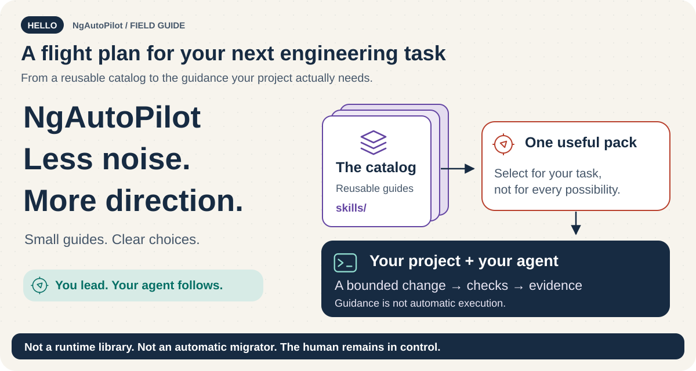
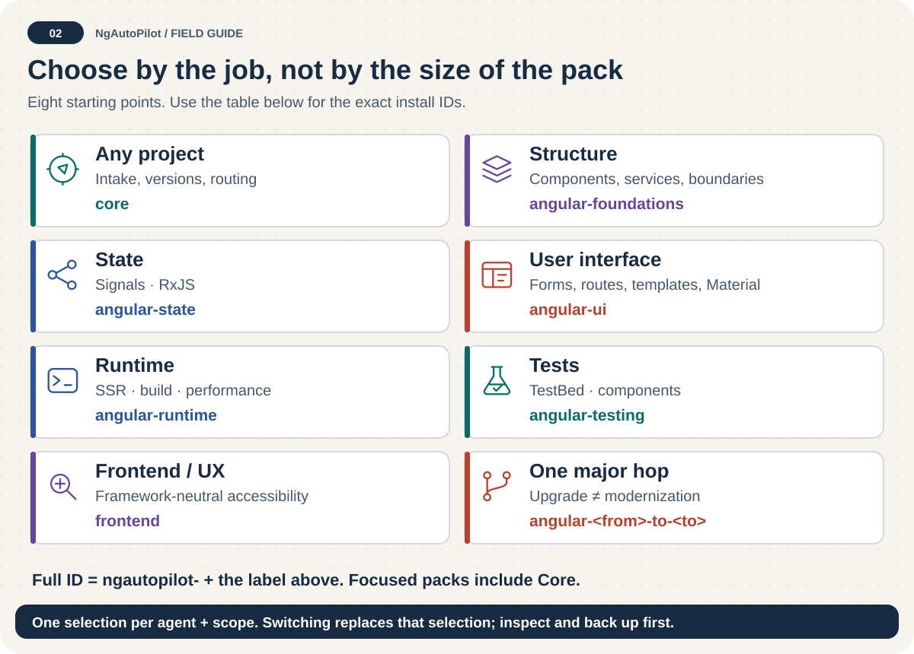
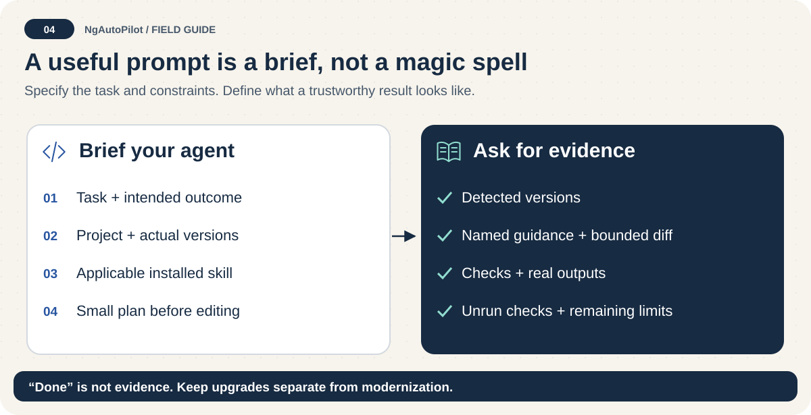
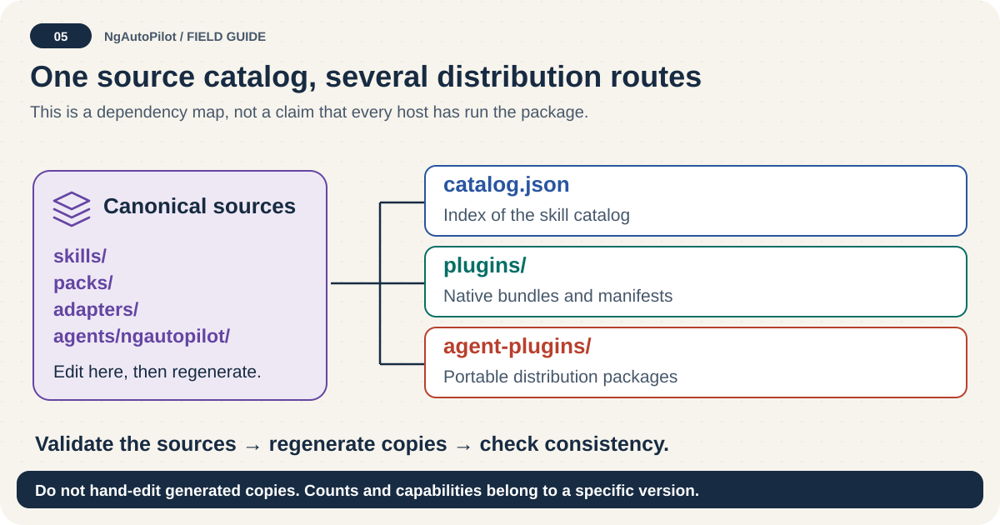

# NgAutoPilot 🚀

[English](README.md) · [Español](README.es.md) · [Documentation map](docs/README.md)

**Give your coding agent a route, not a pile of instructions.**

NgAutoPilot is a CLI and a catalog of small engineering guides (*skills*). It helps an agent inspect your project, detect versions, choose relevant guidance, make a bounded change, and validate the result. It is not an Angular runtime library or an automatic code migrator.



## 🧭 Your first run


You need **Node.js >= 24.0.0 and < 25** for this checkout, npm, a supported agent, and a receiving project. Check the requirements of the package version you install.

Run these commands **inside the receiving project**, not inside this catalog:

```bash
npm exec --package=ngautopilot -- ngautopilot adapters
npm exec --package=ngautopilot -- ngautopilot packs
npm exec --package=ngautopilot -- ngautopilot install --agent codex --pack ngautopilot-angular-foundations --scope project --dry-run
```

1. **Choose:** replace Codex and the foundations pack with IDs printed by the first two commands.
2. **Inspect:** `--dry-run` shows the plan without writing. Review paths and file conflicts.
3. **Approve and verify:** after reviewing the plan, run:

```bash
npm exec --package=ngautopilot -- ngautopilot install --agent codex --pack ngautopilot-angular-foundations --scope project --yes
npm exec --package=ngautopilot -- ngautopilot verify --agent codex --scope project
```

For Codex, expect skills in `.agents/skills/`, managed instructions in the root `AGENTS.md`, and a `.ngautopilot-manifest.json` in the selected install root. Verification checks managed files and checksums; it does **not** prove agent discovery. Open your agent in the receiving project and ask it to identify the applicable installed skill before editing.

> **Version checkpoint:** `npm exec` uses a published package, not this checkout. Pin an exact verified release for reproducible automation. Branch-specific commands must be checked with `node bin/ngautopilot.mjs help` in this repository; do not assume unmerged code is on npm.

**Next:** [first Angular task](docs/first-angular-project.md) · [installation](docs/installation.md) · [troubleshooting](docs/troubleshooting.md).

## 🎒 Pick the pack for today's job



| Your task | Start with |
| --- | --- |
| Basic workflow, any project | `ngautopilot-core` |
| Angular architecture, components, services | `ngautopilot-angular-foundations` |
| Signals and RxJS | `ngautopilot-angular-state` |
| Forms, routes, templates, Material | `ngautopilot-angular-ui` |
| SSR, build, performance, security | `ngautopilot-angular-runtime` |
| Angular tests | `ngautopilot-angular-testing` |
| Framework-neutral accessibility and UX | `ngautopilot-frontend` |
| Exactly one Angular major hop | `ngautopilot-angular-<from>-to-<to>` |

Focused packs include Core through dependencies. Changing packs at the same agent and scope **switches the managed selection**, rather than accumulating all previous packs. Unchanged obsolete managed files may be removed; modified obsolete files are preserved and reported unless forced. Files still selected can be refreshed even if edited. Back up customizations and inspect every switch.

`ngautopilot-angular` and `ngautopilot-full` are deliberate broad choices, not beginner defaults. [All packs and historical hops](docs/packs.md).

## 🧩 Five useful concepts


| Concept | Plain meaning |
| --- | --- |
| Skill | A procedure for one engineering problem |
| Pack | A selection of skills and optional specialist assets |
| Adapter | The installation layout for your agent |
| Subagent role | A Markdown specialist definition; not a running agent by itself |
| Guardrail | A review rule requiring evidence or mitigation; not runtime enforcement |

```text
Your task → inspect → detect versions → select guidance → check risks
         → make a small change → validate → report evidence
```


The decorative animation runs once for 3.6 seconds and respects reduced motion. All steps remain readable in a static preview.

The human directs the task. Skills guide the agent. Tests and review prove the result. Installing Markdown does not grant permissions, deploy services, register MCP, or automatically start subagents.

## 💬 Try a useful prompt



> Inspect this project's Angular, Node, TypeScript, and RxJS versions. Identify the installed NgAutoPilot skill for lazy-loaded routes. Explain the smallest safe change before editing, then validate using the project's existing checks. Report checks you could not run.

For test review, substitute “review fragile TestBed setup and asynchronous behavior.” For upgrades, name the current and next major version and keep modernization separate.

**Success means:** detected versions, a named applicable skill, a bounded plan, and real validation output—not just “done.”

## 🔎 Catalog and repository map



Current catalog size: **413 skills**

This checkout's `doctor` reports **36 packs and 10 adapters**. Run `doctor`, `packs`, and `adapters` for your installed version instead of assuming every release matches.

| Source | Responsibility |
| --- | --- |
| `skills/_core/` | Intake, detection, routing, compatibility, risk |
| `skills/angular/versioning/` | Version-aware decisions |
| `skills/angular/upgrades/` | Major hops, including `skills/angular/upgrades/21-to-22/` |
| `skills/angular/modernization/` | Standalone, control flow, `@defer`, zoneless adoption after stability |
| `skills/angular/architecture/` | Application boundaries and patterns |
| `skills/angular/microfrontends/` | Distributed frontend boundaries |
| `skills/angular/docs/` | ADRs, upgrade reports, review packets |
| `skills/frontend/`, `skills/css/` | Accessibility, UX, design, layout, performance |
| `skills/typescript/`, `skills/javascript/`, `skills/quality/` | Cross-cutting language and quality procedures |

`skills/` is canonical. `catalog.json`, `plugins/`, and `agent-plugins/` are generated distributions; do not hand-edit their copies. [Architecture](docs/ecosystem-architecture.md).

## 🛤️ Choose the right distribution


| Route | What it does | What it does not prove |
| --- | --- | --- |
| NgAutoPilot CLI | Focused packs or supported Angular profiles | Host discovery or invocation |
| `npx skills add janpereira-dev/ngAutoPilot` | Third-party individual-skill discovery | Pack selection; `skills.sh.json` affects only the page |
| Claude/Codex marketplace manifests | Native bundle descriptions | Publication, approval, universal compatibility |
| Agent Plugins Preview | Portable skills plus separate read-only stdio MCP | End-to-end installation in every host |
| Pi metadata | Package discovery | Verified runtime behavior |

Adapter IDs: `claude`, `codex`, `copilot`, `cursor`, `gemini`, `generic`, `hermes`, `openclaw`, `opencode`, `pi`. Native, adapter, experimental, and unverified are different statuses. [Installation matrix](docs/agent-installation-matrix.md).

The OpenAI packet in this branch is **skills-only**, **not submitted**, and **not OpenAI verified**. Human attestations remain human actions. This branch has future-package metadata; do not advertise `openai:validate` unless the version's `package.json` includes it. [Release boundary](docs/openai-marketplace-release.md).

## 📚 Choose your next chapter


| You want to… | Read |
| --- | --- |
| Start without knowing the terminology | [Getting started](docs/getting-started.md) |
| Follow a complete first-use example | [First Angular project](docs/first-angular-project.md) |
| Install, switch, export, or work offline | [Installation](docs/installation.md) |
| Find an exact command | [CLI reference](docs/cli-reference.md) |
| Understand Angular guidance | [Version support](docs/angular-version-support.md), [era map](docs/angular-version-era-map.md) |
| Maintain installed files | [Updating](docs/updating.md), [uninstalling](docs/uninstalling.md) |
| Understand roles and review rules | [Roles](docs/agents-and-subagents.md), [prompts and guardrails](docs/prompts-and-guardrails.md) |
| Register the separate MCP server | [MCP and ChatGPT](docs/mcp-and-chatgpt.md) |
| Contribute or release | [Contributing](CONTRIBUTING.md), [maintainer guide](docs/maintainer-guide.md), [release checklist](docs/release-checklist.md) |

**All guides, historical records, and translation status:** [English map](docs/README.md) · [Mapa en español](docs/README.es.md).

## 🛠️ Maintainer checkpoint


For catalog changes, use the existing source pipeline:

```bash
npm run skills:validate
npm run skills:catalog
npm run plugins:sync
npm run agent-plugins:sync
npm run consistency:validate
```

The [release checklist](docs/release-checklist.md) covers the full validation and packaging procedure. These commands can regenerate files: inspect the diff. Local checks do not prove publication or review approval.

## License and community

MIT · [License](LICENSE) · [Security reporting](SECURITY.md) · [Code of conduct](CODE_OF_CONDUCT.md) · [Changelog](CHANGELOG.md) · [Roadmap](ROADMAP.md)
