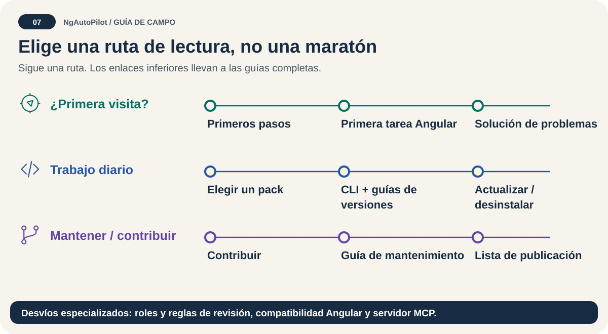

# Mapa de documentación 🗺️

[English](README.md) · [Español](README.es.md) · [Proyecto](../README.es.md)

**Elige una ruta, no una maratón de lectura.** Empieza por Primeros pasos y continúa con la guía de tu próxima tarea. Los archivos predeterminados están en inglés; las versiones españolas utilizan `.es.md`.

## Ruta rápida

1. [Instala y prueba una tarea](getting-started.es.md).
2. [Elige un pack específico](packs.es.md).
3. [Verifica y resuelve problemas](troubleshooting.es.md).

## Alcance y contexto histórico

Este índice cubre documentación para lectores: políticas raíz, todo Markdown de `docs/`, guía del registro de roles, guías de Skill Lab, expedientes de envío y README del salto Angular. Los archivos operativos `SKILL.md`, prompts y roles de agentes, plantillas de adaptadores, entradas de benchmarks y copias generadas conservan sus instrucciones canónicas; no se convierten en instrucciones independientes traducidas. Las guías bilingües explican su uso. Los registros históricos conservan fechas y decisiones y no garantizan capacidades actuales. Este mapa completo corresponde al checkout del repositorio: Skill Lab y los expedientes de envío OpenAI no se incluyen en npm; sus enlaces requieren ese checkout.

## Todos los documentos

| Documento en español | Tipo | Fuente inglesa |
| --- | --- | --- |
| [Historial de cambios](../CHANGELOG.es.md) | Registro histórico | [English](../CHANGELOG.md) |
| [Código de conducta de Contributor Covenant](../CODE_OF_CONDUCT.es.md) | Guía / política | [English](../CODE_OF_CONDUCT.md) |
| [Contribuir a NgAutoPilot 🤝](../CONTRIBUTING.es.md) | Guía / política | [English](../CONTRIBUTING.md) |
| [NgAutoPilot 🚀](../README.es.md) | Guía / política | [English](../README.md) |
| [Hoja de ruta de NgAutoPilot 🧭](../ROADMAP.es.md) | Guía / política | [English](../ROADMAP.md) |
| [Política de seguridad 🛡️](../SECURITY.es.md) | Guía / política | [English](../SECURITY.md) |
| [Registro de subagentes NgAutoPilot](../agents/ngautopilot/README.es.md) | Guía / política | [English](../agents/ngautopilot/README.md) |
| [Matriz de instalación por agente 🧭](agent-installation-matrix.es.md) | Guía / política | [English](agent-installation-matrix.md) |
| [Agent Plugins: evidencias de compatibilidad](agent-plugins/compatibility.es.md) | Guía / política | [English](agent-plugins/compatibility.md) |
| [Agent Plugins en vista previa 📦](agent-plugins/overview.es.md) | Guía / política | [English](agent-plugins/overview.md) |
| [Agentes y subagentes: roles, no procesos automáticos 🛠](agents-and-subagents.es.md) | Guía / política | [English](agents-and-subagents.md) |
| [Angular 22: utiliza la API adecuada, no solo la más nueva 🔎](angular-22-support.es.md) | Guía / política | [English](angular-22-support.md) |
| [Informe de extracción Angular Can I Use](angular-caniuse/README.es.md) | Registro histórico | [English](angular-caniuse/README.md) |
| [Catálogo Angular: elige una ruta 🧭](angular-roadmap-guide.es.md) | Guía / política | [English](angular-roadmap-guide.md) |
| [Mapa de carpetas Angular por épocas](angular-version-era-map.es.md) | Guía / política | [English](angular-version-era-map.md) |
| [Cobertura de versiones Angular 🧭](angular-version-support.es.md) | Guía / política | [English](angular-version-support.md) |
| [Referencia de la CLI de NgAutoPilot 🛠️](cli-reference.es.md) | Guía / política | [English](cli-reference.md) |
| [Uso multiplataforma 🖥️](cross-platform.es.md) | Guía / política | [English](cross-platform.md) |
| [Guía de calidad de diseño 🎨](design-excellence-guide.es.md) | Guía / política | [English](design-excellence-guide.md) |
| [Arquitectura del ecosistema NgAutoPilot 🧩](ecosystem-architecture.es.md) | Guía / política | [English](ecosystem-architecture.md) |
| [Tu primera tarea Angular con NgAutoPilot 🚀](first-angular-project.es.md) | Guía / política | [English](first-angular-project.md) |
| [Primeros pasos: tu primera tarea segura 🧭](getting-started.es.md) | Guía / política | [English](getting-started.md) |
| [Instalación: inspeccionar → aprobar → verificar 🎒](installation.es.md) | Guía / política | [English](installation.md) |
| [Guía de mantenimiento 🛠️](maintainer-guide.es.md) | Guía / política | [English](maintainer-guide.md) |
| [MCP y ChatGPT: instalación no es registro 🔌](mcp-and-chatgpt.es.md) | Guía / política | [English](mcp-and-chatgpt.md) |
| [Auditoría histórica de nuevas skills](new-skills-audit.es.md) | Registro histórico | [English](new-skills-audit.md) |
| [Guía del paquete npm 📦](npm-package-guide.es.md) | Guía / política | [English](npm-package-guide.md) |
| [Preparación de publicación OpenAI 📦](openai-marketplace-release.es.md) | Guía / política | [English](openai-marketplace-release.md) |
| [Packs de NgAutoPilot 🎒](packs.es.md) | Guía / política | [English](packs.md) |
| [Prompts y guardrails: de la petición a una revisión útil 🧭](prompts-and-guardrails.es.md) | Guía / política | [English](prompts-and-guardrails.md) |
| [Lista de publicación: evidencia local antes de distribuir 📦](release-checklist.es.md) | Guía / política | [English](release-checklist.md) |
| [Revisión orientada a Sage: primero expediente, después revisión externa](sage-review.es.md) | Guía / política | [English](sage-review.md) |
| [Modelo de seguridad de NgAutoPilot 🛡️](security-model.es.md) | Guía / política | [English](security-model.md) |
| [Diseño histórico de correcciones de revisión de Skill Lab](specs/2026-08-07-skill-lab-review-remediation-design.es.md) | Registro histórico | [English](specs/2026-08-07-skill-lab-review-remediation-design.md) |
| [Ciclo histórico de optimización de skills NgAutoPilot](specs/skill-optimization-loop.es.md) | Registro histórico | [English](specs/skill-optimization-loop.md) |
| [Plan histórico de correcciones de revisión de Skill Lab](superpowers/plans/2026-08-07-skill-lab-review-remediation.es.md) | Registro histórico | [English](superpowers/plans/2026-08-07-skill-lab-review-remediation.md) |
| [Plan histórico de implementación Agent Plugins 0.6.0](superpowers/plans/2026-08-09-agent-plugins-0-6.es.md) | Registro histórico | [English](superpowers/plans/2026-08-09-agent-plugins-0-6.md) |
| [Diseño histórico de Agent Plugins NgAutoPilot 0.6.0](superpowers/specs/2026-08-09-agent-plugins-0-6-design.es.md) | Registro histórico | [English](superpowers/specs/2026-08-09-agent-plugins-0-6-design.md) |
| [Solución de problemas: encuentra la capa que falla 🔧](troubleshooting.es.md) | Guía / política | [English](troubleshooting.md) |
| [Niveles de confianza: clasifica la acción 🔐](trust-levels.es.md) | Guía / política | [English](trust-levels.md) |
| [Desinstala sin borrar tu propio trabajo 🧹](uninstalling.es.md) | Guía / política | [English](uninstalling.md) |
| [Actualiza con seguridad: crea una copia antes 🔄](updating.es.md) | Guía / política | [English](updating.md) |
| [NgAutoPilot Skills](../openai/submission/0.6.0/listing.es.md) | Registro histórico | [English](../openai/submission/0.6.0/listing.md) |
| [Declaración de cumplimiento](../openai/submission/0.6.0/policy-attestation.es.md) | Registro histórico | [English](../openai/submission/0.6.0/policy-attestation.md) |
| [Notas de release y disponibilidad](../openai/submission/0.6.0/release-notes.es.md) | Registro histórico | [English](../openai/submission/0.6.0/release-notes.md) |
| [Casos de prueba del envío](../openai/submission/0.6.0/test-cases.es.md) | Registro histórico | [English](../openai/submission/0.6.0/test-cases.md) |
| [Historial de cambios de Skill Lab](../skill-lab/CHANGELOG.es.md) | Registro histórico | [English](../skill-lab/CHANGELOG.md) |
| [Política de Skill Lab](../skill-lab/POLICY.es.md) | Guía / política | [English](../skill-lab/POLICY.md) |
| [Skill Lab de NgAutoPilot 🧪](../skill-lab/README.es.md) | Guía / política | [English](../skill-lab/README.md) |
| [Skills para actualizar Angular 21 → 22](../skills/angular/upgrades/21-to-22/README.es.md) | Guía / política | [English](../skills/angular/upgrades/21-to-22/README.md) |

## Límites de validación

Un enlace indica que existe una edición, no que sus afirmaciones se hayan verificado automáticamente. `node scripts/documentation.mjs validate` comprueba pares, enlaces y anclas Markdown locales, sustitución UTF-8, controles invisibles/bidireccionales, marcadores de traducción sin resolver, referencias provisionales obsoletas y bloques delimitados equilibrados. No certifica calidad de redacción, enlaces externos, renderizado HTML ni ejecución del agente. Utiliza `--allow-incomplete` solo durante el trabajo: informa de ediciones ausentes sin considerar la cobertura completa.
