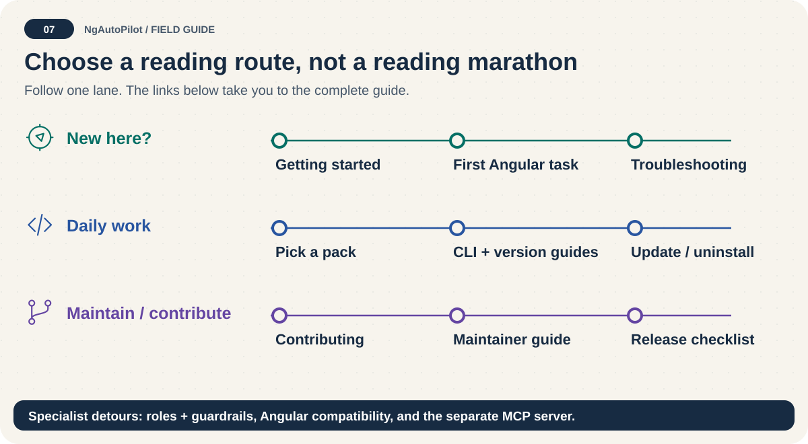

# Documentation map 🗺️

[English](README.md) · [Español](README.es.md) · [Project](../README.md)

**Choose a route, not a reading marathon.** Start with Getting Started, then read only the guide matching your next task. English files are the default; Spanish companions use `.es.md`.

## Quick route

1. [Install and try one task](getting-started.md).
2. [Choose a focused pack](packs.md).
3. [Verify and troubleshoot](troubleshooting.md).

## Scope and historical context

This index covers reader-facing documentation, including root policies, all Markdown under `docs/`, role-registry guidance, Skill Lab guides, versioned submission records, and the Angular hop README. Runtime `SKILL.md`, agent prompts/roles, adapter templates, benchmark inputs, and generated copies remain operational source artifacts, not independently translated instructions. Their purpose and use are explained by the bilingual guides. Historical records retain their original dates and decisions; they are not current feature guarantees. This complete map is for a repository checkout: Skill Lab and versioned OpenAI submission records are intentionally absent from the npm tarball, so their links require the checkout.

## Every document

| English source | Type | Spanish edition |
| --- | --- | --- |
| [Changelog](../CHANGELOG.md) | Historical record | [Español](../CHANGELOG.es.md) |
| [Contributor Covenant Code of Conduct](../CODE_OF_CONDUCT.md) | Guide / policy | [Español](../CODE_OF_CONDUCT.es.md) |
| [Contributing to NgAutoPilot](../CONTRIBUTING.md) | Guide / policy | [Español](../CONTRIBUTING.es.md) |
| [NgAutoPilot 🚀](../README.md) | Guide / policy | [Español](../README.es.md) |
| [NgAutoPilot Roadmap](../ROADMAP.md) | Guide / policy | [Español](../ROADMAP.es.md) |
| [Security Policy](../SECURITY.md) | Guide / policy | [Español](../SECURITY.es.md) |
| [NgAutoPilot Subagents Registry](../agents/ngautopilot/README.md) | Guide / policy | [Español](../agents/ngautopilot/README.es.md) |
| [Agent Installation Matrix](agent-installation-matrix.md) | Guide / policy | [Español](agent-installation-matrix.es.md) |
| [Agent Plugins: compatibility evidence](agent-plugins/compatibility.md) | Guide / policy | [Español](agent-plugins/compatibility.es.md) |
| [Agent Plugins Preview 📦](agent-plugins/overview.md) | Guide / policy | [Español](agent-plugins/overview.es.md) |
| [Agents and Subagents](agents-and-subagents.md) | Guide / policy | [Español](agents-and-subagents.es.md) |
| [Angular 22: use the right API, not just the newest one 🔎](angular-22-support.md) | Guide / policy | [Español](angular-22-support.es.md) |
| [Angular Can I Use Extraction Report](angular-caniuse/README.md) | Historical record | [Español](angular-caniuse/README.es.md) |
| [Angular catalog: choose one route 🧭](angular-roadmap-guide.md) | Guide / policy | [Español](angular-roadmap-guide.es.md) |
| [Angular Version Era Folder Map](angular-version-era-map.md) | Guide / policy | [Español](angular-version-era-map.es.md) |
| [Angular version coverage 🧭](angular-version-support.md) | Guide / policy | [Español](angular-version-support.es.md) |
| [NgAutoPilot CLI Reference](cli-reference.md) | Guide / policy | [Español](cli-reference.es.md) |
| [Cross-Platform Support](cross-platform.md) | Guide / policy | [Español](cross-platform.es.md) |
| [Design Excellence Guide](design-excellence-guide.md) | Guide / policy | [Español](design-excellence-guide.es.md) |
| [NgAutoPilot Ecosystem Architecture](ecosystem-architecture.md) | Guide / policy | [Español](ecosystem-architecture.es.md) |
| [Your first Angular task with NgAutoPilot 🚀](first-angular-project.md) | Guide / policy | [Español](first-angular-project.es.md) |
| [Getting started: your first safe task 🧭](getting-started.md) | Guide / policy | [Español](getting-started.es.md) |
| [Installation: inspect → approve → verify 🎒](installation.md) | Guide / policy | [Español](installation.es.md) |
| [Maintainer Guide](maintainer-guide.md) | Guide / policy | [Español](maintainer-guide.es.md) |
| [MCP and ChatGPT Integration](mcp-and-chatgpt.md) | Guide / policy | [Español](mcp-and-chatgpt.es.md) |
| [New Skills Staging Audit](new-skills-audit.md) | Historical record | [Español](new-skills-audit.es.md) |
| [npm Package Guide](npm-package-guide.md) | Guide / policy | [Español](npm-package-guide.es.md) |
| [OpenAI Marketplace Release Preparation](openai-marketplace-release.md) | Guide / policy | [Español](openai-marketplace-release.es.md) |
| [NgAutoPilot Packs](packs.md) | Guide / policy | [Español](packs.es.md) |
| [Prompts and Guardrails](prompts-and-guardrails.md) | Guide / policy | [Español](prompts-and-guardrails.es.md) |
| [Release checklist: local proof before public delivery 📦](release-checklist.md) | Guide / policy | [Español](release-checklist.es.md) |
| [Sage-oriented review: packet first, external review second](sage-review.md) | Guide / policy | [Español](sage-review.es.md) |
| [NgAutoPilot Security Model](security-model.md) | Guide / policy | [Español](security-model.es.md) |
| [Skill Lab Review Remediation Design](specs/2026-08-07-skill-lab-review-remediation-design.md) | Historical record | [Español](specs/2026-08-07-skill-lab-review-remediation-design.es.md) |
| [NgAutoPilot Skill Optimization Loop](specs/skill-optimization-loop.md) | Historical record | [Español](specs/skill-optimization-loop.es.md) |
| [Skill Lab Review Remediation Implementation Plan](superpowers/plans/2026-08-07-skill-lab-review-remediation.md) | Historical record | [Español](superpowers/plans/2026-08-07-skill-lab-review-remediation.es.md) |
| [Agent Plugins 0.6.0 Implementation Plan](superpowers/plans/2026-08-09-agent-plugins-0-6.md) | Historical record | [Español](superpowers/plans/2026-08-09-agent-plugins-0-6.es.md) |
| [NgAutoPilot 0.6.0 Agent Plugins Design](superpowers/specs/2026-08-09-agent-plugins-0-6-design.md) | Historical record | [Español](superpowers/specs/2026-08-09-agent-plugins-0-6-design.es.md) |
| [Troubleshooting: find the failing layer 🔧](troubleshooting.md) | Guide / policy | [Español](troubleshooting.es.md) |
| [NgAutoPilot Trust Levels](trust-levels.md) | Guide / policy | [Español](trust-levels.es.md) |
| [Uninstall without deleting your own work 🧹](uninstalling.md) | Guide / policy | [Español](uninstalling.es.md) |
| [Update safely: back up before refreshing 🔄](updating.md) | Guide / policy | [Español](updating.es.md) |
| [NgAutoPilot Skills](../openai/submission/0.6.0/listing.md) | Historical record | [Español](../openai/submission/0.6.0/listing.es.md) |
| [Policy attestation](../openai/submission/0.6.0/policy-attestation.md) | Historical record | [Español](../openai/submission/0.6.0/policy-attestation.es.md) |
| [Release notes and availability](../openai/submission/0.6.0/release-notes.md) | Historical record | [Español](../openai/submission/0.6.0/release-notes.es.md) |
| [Submission test cases](../openai/submission/0.6.0/test-cases.md) | Historical record | [Español](../openai/submission/0.6.0/test-cases.es.md) |
| [Skill Lab Changelog](../skill-lab/CHANGELOG.md) | Historical record | [Español](../skill-lab/CHANGELOG.es.md) |
| [Skill Lab Policy](../skill-lab/POLICY.md) | Guide / policy | [Español](../skill-lab/POLICY.es.md) |
| [NgAutoPilot Skill Lab](../skill-lab/README.md) | Guide / policy | [Español](../skill-lab/README.es.md) |
| [Angular 21 to 22 Upgrade Skills](../skills/angular/upgrades/21-to-22/README.md) | Guide / policy | [Español](../skills/angular/upgrades/21-to-22/README.es.md) |

## Validation boundary

A link means an edition exists, not that its technical claims are automatically verified. `node scripts/documentation.mjs validate` checks pair coverage, local Markdown links/anchors, UTF-8 replacement and invisible/bidirectional controls, unresolved translation tokens, stale fallbacks, and balanced fenced blocks. It does not certify prose quality, external URLs, HTML rendering, or actual agent execution. Use `--allow-incomplete` only during ongoing work; it reports missing editions without treating coverage as complete.
