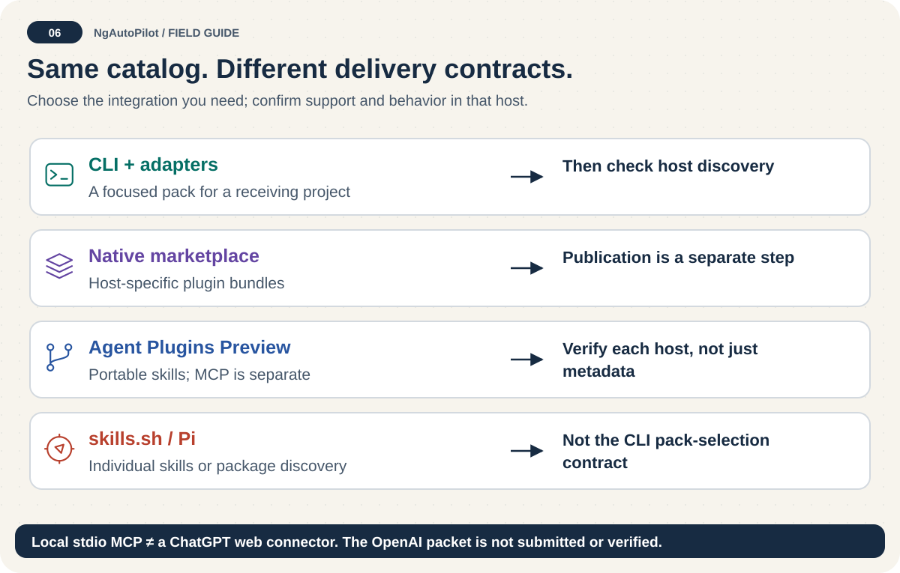

# Agent installation matrix

<!-- docs:navigation:start -->
[Español](agent-installation-matrix.es.md) · [Map](README.md) · [Home](../README.md)

<!-- docs:navigation:end -->

> Legacy install layouts are not the native export contract. See [adapter maintenance](adapter-maintenance.md) for the current source-backed export paths and explicit host-verification limits. No matrix entry alone proves runtime discovery.




NgAutoPilot uses one catalog and pack policy across supported clients. The adapter controls destination layout and instruction filenames; it does not configure the host client itself.

## Recommended flow

Run the commands from the receiving project. Always inspect the plan first:

```bash
npm exec --package=ngautopilot -- ngautopilot adapters
npm exec --package=ngautopilot -- ngautopilot packs
npm exec --package=ngautopilot -- ngautopilot install --agent codex --pack ngautopilot-angular-5-to-6 --scope project --dry-run
npm exec --package=ngautopilot -- ngautopilot install --agent codex --pack ngautopilot-angular-5-to-6 --scope project --yes
npm exec --package=ngautopilot -- ngautopilot verify --agent codex --scope project
```

For a multi-major migration, install and validate each named hop in order. This branch also provides `--angular` profile selection and `migrate` planning/gates; check your installed version's help. A plan or installed hop guide is not an automatic source transformation.

## Compatibility matrix

| Client | Adapter ID | Status | Project skills destination | Project instruction file |
| --- | --- | --- | --- | --- |
| Claude Code | `claude` | native | `.claude/` | `CLAUDE.md` |
| OpenAI Codex | `codex` | native | `.agents/skills/` | `AGENTS.md` at the Git root |
| GitHub Copilot | `copilot` | adapter | `.github/copilot/` | `copilot-instructions.md` |
| Cursor | `cursor` | adapter | `.cursor/` | `.cursorrules` |
| Gemini CLI | `gemini` | adapter | `.gemini/` | `GEMINI.md` |
| OpenCode | `opencode` | native | `.opencode/` | `AGENTS.md` inside `.opencode/` (legacy) |
| OpenClaw | `openclaw` | experimental | `.openclaw/` | `AGENTS.md` inside `.openclaw/` (legacy) |
| Pi | `pi` | unverified | `.pi/` | `PI.md` |
| Hermes Agent | `hermes` | unverified | `.hermes/` | `HERMES.md` |
| Generic Markdown client | `generic` | export-only | chosen export directory | `AGENTS.md` |

Treat `ngautopilot adapters --json` as the machine-readable **legacy installer** descriptor; native export paths are recorded separately in `adapters/native-layouts.json`. Experimental and unverified adapters require host-specific verification before team-wide use.

## Codex paths and MCP

The Codex adapter intentionally uses more than one destination. A project install writes skills to `.agents/skills/` and its managed instructions to the repository-root `AGENTS.md`. A user install writes skills to `~/.agents/skills/` and instructions to `~/.codex/AGENTS.md`. `.codex/skills/` is not a Codex skill-discovery path.

MCP registration is separate from installing a pack. See [MCP and ChatGPT Integration](mcp-and-chatgpt.md) for the exact `codex mcp add` command or `config.toml` block.

## Pack selection

- Use `ngautopilot-angular` for broad Angular development.
- Use a named `ngautopilot-angular-<from>-to-<to>` pack for one historical upgrade hop.
- Use `ngautopilot-angular-upgrades` for the complete upgrade guidance set.
- Use `ngautopilot export --agent generic --pack <id> --output <dir>` when the client lacks a native adapter.

Pack switching removes unchanged obsolete managed files. Modified obsolete files are preserved and reported unless forced. Desired files are preserved when locally edited unless explicitly forced; back up before switching or updating.

Client references: [Codex skills](https://learn.chatgpt.com/docs/build-skills) and [Codex MCP](https://learn.chatgpt.com/docs/extend/mcp?surface=cli), reviewed on 2026-10-01.
