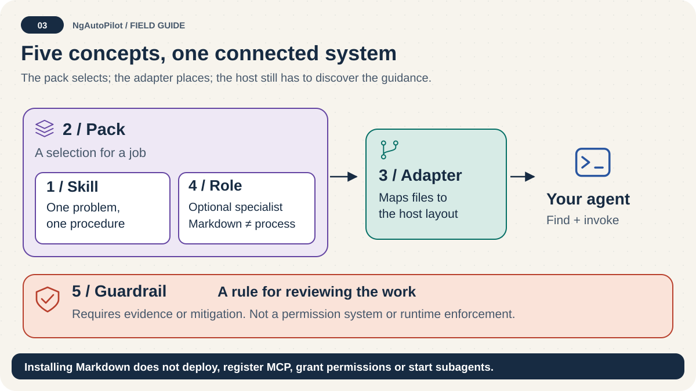

# Agents and Subagents

<!-- docs:navigation:start -->
[Español](agents-and-subagents.es.md) · [Map](README.md) · [Home](../README.md)

<!-- docs:navigation:end -->



## Overview

NgAutoPilot ships 8 canonical agent roles under `agents/ngautopilot/`. These are reference Markdown files — not executable agents. An AI agent reads the role definition and adopts the persona for a focused task.

## Invocation policy

First select a skill, then choose a role that adds independent review value.
Load it manually or through a verified host capability and record the results.

```text
1 task → 1 orchestrator → max 3 primary subagents → helpers only under trigger
```

Do not activate all subagents for every task.

## Primary subagents

| File | Role | Trigger |
| --- | --- | --- |
| `subagents/primary/01-spartan-contrarian-developer.md` | Skeptical implementation reviewer | Production code changes, fragile tests, optimistic claims |
| `subagents/primary/02-athenian-angular-architect.md` | Angular architect and structure guardian | Angular work, version detection, skill availability |
| `subagents/primary/03-roman-consolidator.md` | Delivery consolidator and validation closer | End of a task with multiple subagents involved |

## Support subagents

| File | Role | Trigger |
| --- | --- | --- |
| `subagents/support/04-stoic-typescript-guardian.md` | TypeScript strictness and contracts | TypeScript files modified, DTOs, casts, `any` |
| `subagents/support/05-rxjs-oracle.md` | RxJS and reactive flow reviewer | RxJS code, subscriptions, memory leaks |
| `subagents/support/06-testing-hoplite.md` | Jest and spec stability | `.spec.ts` changes, TestBed, fakeAsync |
| `subagents/support/07-compatibility-gatekeeper.md` | Version and migration risk | `package.json` changes, upgrade hops |
| `subagents/support/08-repo-cartographer.md` | Repository structure and discovery | New skills, catalog changes, missing SKILL.md |

## Integration

Each subagent file defines:

- Identity and philosophical style
- Mission
- Activation triggers
- Inputs expected
- Responsibilities
- Non-goals
- Operating protocol (output format)
- Required NgAutoPilot skills
- Definition of done

## How agents use them

A host can read the matching role manually or through a supported capability.
Installation alone does not prove automatic activation, parallel execution, or
role adoption. NgAutoPilot routes guidance; the role adds focused oversight.
The host's permissions and the user's authorization govern real delegation.

## Pack Assignment

| Pack | Agents included |
| --- | --- |
| `ngautopilot-angular` | `athenian-angular-architect` |
| `ngautopilot-angular-upgrades` | `compatibility-gatekeeper` |
| `ngautopilot-typescript` | `stoic-typescript-guardian` |
| `ngautopilot-quality` | `spartan-contrarian-developer`, `roman-consolidator` |
| `ngautopilot-full` | All 8 |

Focused Angular packs include only matching specialist role: Foundations includes `athenian-angular-architect`, State includes `rxjs-oracle`, Testing includes `testing-hoplite`, and migration or upgrade-hop packs include `compatibility-gatekeeper`. All focused packs resolve Core automatically.
