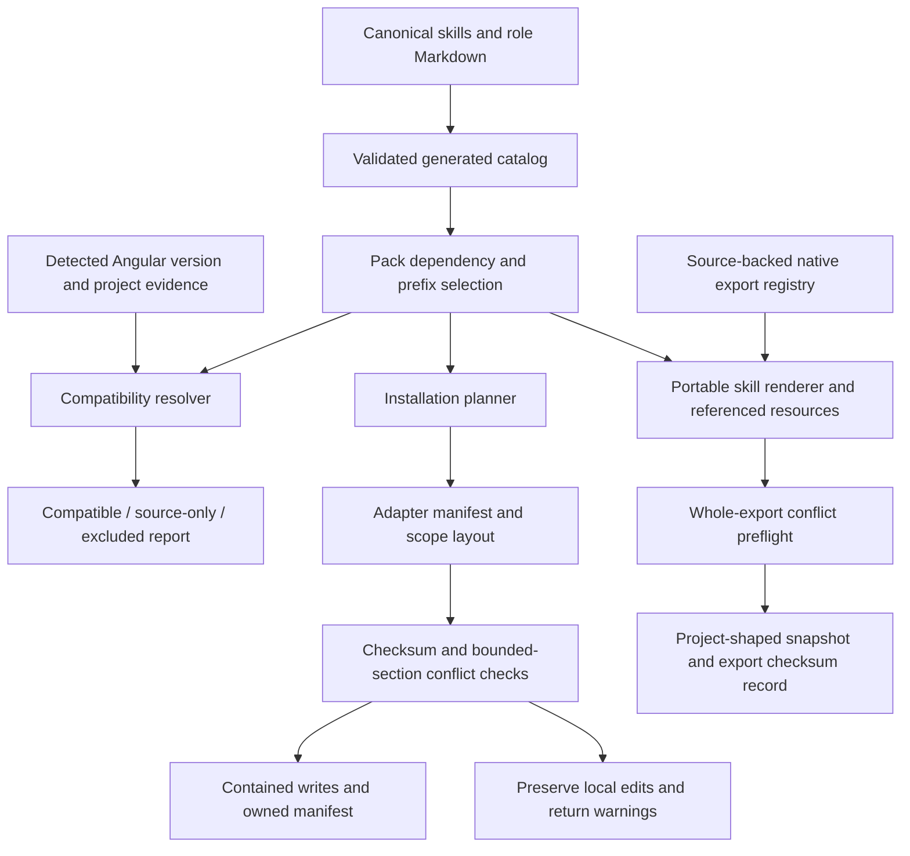
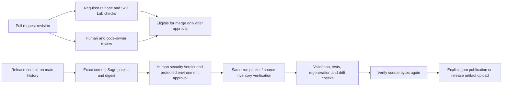

# NgAutoPilot Ecosystem Architecture

## Single source of truth

```text
skills/          Canonical skill source (Markdown SKILL.md files)
agents/ngautopilot/   Canonical agent/subagent source (Markdown role definitions)
adapters/        Adapter manifests + templates + shared installer core
packs/            Declarative pack definitions (JSON)
plugins/          Generated distribution bundles (synced from skills/)
schemas/          JSON schemas for skills, packs, adapters, install manifests
catalog.json      Generated catalog index (never hand-edited)
```

## Generation pipeline

```text
skills/**/SKILL.md
       │
       ├── npm run skills:validate          → validate frontmatter + sections
       ├── npm run skills:catalog           → generate catalog.json
       └── npm run skills:validate:frontmatter → validate frontmatter schema
                │
                ▼
         catalog.json (index)
                │
       npm run plugins:sync → plugins/*/skills/** (generated copies)
                │
       npm run consistency:validate → verify skills ↔ plugins ↔ catalog
                │
       npm run marketplaces:validate → Claude + Codex marketplace JSONs
```

## Installation pipeline

```text
packs/<pack-id>.json
       │
       ▼
   buildPlan()                        → resolve dependencies, then match skills by ID prefix
       │
       ▼
   applyPlan()                        → safe-fs switch, copy, and manifest write
       │
       ▼
  <install-root>/.ngautopilot-manifest.json
```

## Data flow

```text
┌─────────────┐      ┌──────────┐      ┌─────────────┐
│ skills/     │─────▶│ catalog  │─────▶│ packs/      │
│ (canonical) │      │ .json    │      │ (selection) │
└─────────────┘      └──────────┘      └──────┬──────┘
                                                │
                                    buildPlan() │
                                                ▼
                ┌───────────────────────────────────────┐
                │ Installer (safe-fs + adapter core)    │
                │                                       │
                │  plan → conflict check → apply → manifest     │
                └───────────────────┬───────────────────┘
                                    │
                    ┌───────────────┼───────────────┐
                    ▼               ▼               ▼
              .agents/        .claude/        .opencode/
              (project)       (project)       (project)
                    │               │               │
                    └──── manifest.json ────────────┘
```

## Adapter contract

Each adapter directory contains:

- `manifest.json` — declarative descriptor (id, scope, paths, formats, status)
- Optional: `<instructions>.template.md` — instruction file template

The installer core in `adapters/_shared/` provides:

- `safe-fs.mjs` — path-traversal-safe, symlink-escape-safe filesystem layer
- `adapter-core.mjs` — adapter loading and detection
- `planner.mjs` — plan computation from pack + catalog + adapter
- `installer.mjs` — backup, apply, verify, uninstall, restore

## Key rule

```text
One capability is maintained once.
Adapters transform.
Packs select and depend.
Plugins distribute.
The catalog indexes.
The installer applies.
```

## Native export and compatibility boundaries



`angular` provides the version-aware compatibility decision. A source pack or native export is **not** automatic project-version approval: catalog inclusion and host-format compatibility are separate from Angular API compatibility. The installer consumes pack selection; it does not silently run migrations or modernize the application.

Export snapshots deliberately use a separate record from installations. Non-Codex legacy installation roots are not silently migrated by native export. See [adapter maintenance](adapter-maintenance.md) and [pack transitions](pack-transitions.md). Backup is an explicit recoverability step, not automatic permission to overwrite.

## Validation and publication



Packet generation, tests, approval, merge, and publication are different states. The release workflow does not approve itself. The scheduled quarterly adapter audit opens a tracking issue; documentation review and real host invocation remain explicit evidence levels.
