# Your first Angular task with NgAutoPilot 🚀

<!-- docs:navigation:start -->
[Español](first-angular-project.es.md) · [Map](README.md) · [Home](../README.md)

<!-- docs:navigation:end -->



**Goal:** inspect a real Angular project, install focused guidance, and complete one small reviewed task. There is no guaranteed five-minute execution time; package downloads, project size, and agent availability vary.

## 1. Start in your existing Angular project

Check the project root and `package.json`. You need a supported Node version for the NgAutoPilot release you use. Do not create or replace the application's dependencies just to follow this guide.

## 2. Install one focused pack

For the routing exercise below, choose the UI pack. Core is included automatically; no separate Core install is needed.

```bash
npm exec --package=ngautopilot -- ngautopilot install --agent codex --pack ngautopilot-angular-ui --scope project --dry-run
npm exec --package=ngautopilot -- ngautopilot install --agent codex --pack ngautopilot-angular-ui --scope project --yes
npm exec --package=ngautopilot -- ngautopilot verify --agent codex --scope project
```

Review the dry run before approval. For reproducibility, pin an exact published npm version. For Codex, check `.agents/skills/` and root `AGENTS.md`.

## 3. Open the agent and try this task

> Inspect my routing and the Angular/toolchain versions. Identify installed guidance for lazy loading. Propose the smallest compatible change; keep unrelated modernization out of scope. After approval, validate with the existing project checks and report missing evidence.

Expected workflow: intake → detect versions → route to matching guidance → check compatibility → bounded edit → validation. A role file is not an automatically running reviewer.

## 4. Check the result

- [ ] The agent found the actual Angular version.
- [ ] It identified an installed relevant skill.
- [ ] The diff only addresses the routing task.
- [ ] Available tests/build checks ran, or limitations were reported.
- [ ] You reviewed the code and behavior.

`doctor` checks the catalog, packs, and adapters. It does not replace your application's tests.

## 5. Try another mission

| Task | Focused pack | Example request |
| --- | --- | --- |
| Angular 21 → 22 upgrade | `ngautopilot-angular-21-to-22` | Detect toolchain compatibility and plan only this hop |
| Accessibility review | `ngautopilot-frontend` | Review keyboard navigation and form errors |
| Microfrontend boundaries | `ngautopilot-angular-microfrontends` | Inspect boundaries before proposing federation configuration |
| Reliable component tests | `ngautopilot-angular-testing` | Review TestBed and asynchronous behavior without changing the runner |

Switching packs changes the managed selection. Back up first, preview the switch, then approve. Migration setup is a plan, not an executable code upgrade.

## 6. Maintain or remove

Follow [updating](updating.md) and [uninstalling](uninstalling.md), which include backup, preview, approval, and verification. [Complete documentation map](README.md).
