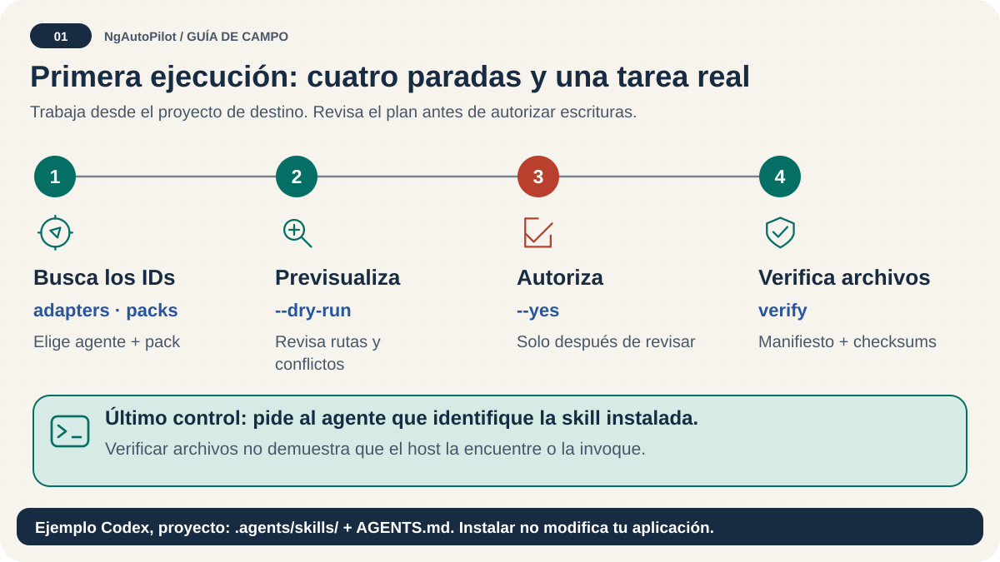

# Primeros pasos: tu primera tarea segura 🧭

<!-- docs:navigation:start -->
[English](getting-started.md) · [Mapa](README.es.md) · [Inicio](../README.es.md)

<!-- docs:navigation:end -->



**Resultado:** instalar un pack relevante y comprobar que el agente encuentra sus guías. Empieza en un proyecto existente; NgAutoPilot no crea una aplicación Angular.

## 1. Comprueba las herramientas

Este checkout requiere Node.js >= 24.0.0 y < 25. Ejecuta `node --version` y después:

```bash
npm exec --package=ngautopilot -- ngautopilot help
npm exec --package=ngautopilot -- ngautopilot adapters
npm exec --package=ngautopilot -- ngautopilot packs
```

Estos comandos inspeccionan una versión publicada. Para esta rama, usa `node bin/ngautopilot.mjs help` desde el repositorio NgAutoPilot. En automatizaciones fija una versión publicada exacta.

## 2. Inspecciona y después aprueba

Ejecuta desde la raíz del proyecto receptor:

```bash
npm exec --package=ngautopilot -- ngautopilot install --agent codex --pack ngautopilot-angular-foundations --scope project --dry-run
npm exec --package=ngautopilot -- ngautopilot install --agent codex --pack ngautopilot-angular-foundations --scope project --yes
npm exec --package=ngautopilot -- ngautopilot verify --agent codex --scope project
```

Revisa el primer comando antes de ejecutar el segundo. `--yes` aprueba la escritura; sin él, una operación que requiere aprobación no escribe. `verify` comprueba archivos, no el descubrimiento en el cliente.

## 3. Pide una tarea acotada

Abre tu agente en el proyecto y solicita:

> Inspecciona el stack y sus versiones. Encuentra la guía instalada de NgAutoPilot para revisar límites de componentes. Explica un plan pequeño antes de editar e indica qué comprobaciones existentes puedes ejecutar.

La ruta esperada es recepción → detección → selección de skill → compatibilidad y riesgo → cambio acotado → validación. No necesitas cargar todas las skills ni todos los revisores.

## 4. Encuentra el siguiente paso

| Necesidad | Guía |
| --- | --- |
| Ejercicio Angular completo | [Primer proyecto Angular](first-angular-project.es.md) |
| Otro agente, ámbito o uso sin conexión | [Instalación](installation.es.md) |
| Elegir un pack para una tarea concreta | [Packs](packs.es.md) |
| Comandos o controles de migración | [Referencia CLI](cli-reference.es.md) |
| Algo no funcionó | [Solución de problemas](troubleshooting.es.md) |

`init` está obsoleto. Utiliza `install` o `export` explícitos. La preparación de migraciones crea un plan, no transforma código; una ejecución puede detenerse en `awaiting-executor` y no permite omitir un bloqueo.
