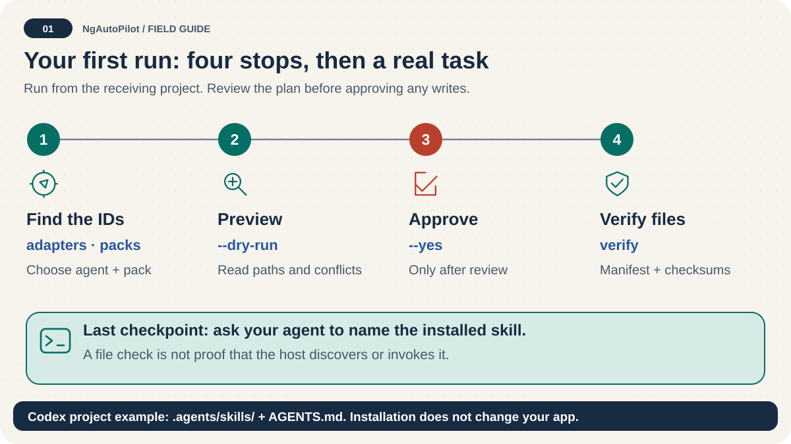

# Installation: inspect → approve → verify 🎒

<!-- docs:navigation:start -->
[Español](installation.es.md) · [Map](README.md) · [Home](../README.md)

<!-- docs:navigation:end -->



**Outcome:** place a focused selection of guidance in the right locations for your agent, without confusing installation with automatic execution.

## Before you start

- This checkout requires Node.js >= 24.0.0 and < 25.
- Work from the receiving project's root.
- Inspect available IDs with `ngautopilot adapters` and `ngautopilot packs`.
- Back up an existing installation before updating or switching packs. This branch can refresh edited files that remain in the managed selection.
- The examples below use a published npm package. Pin an exact release in automation; inspect local branch features with `node bin/ngautopilot.mjs help` in this repository.

## 1. Choose one pack and preview

```bash
npm exec --package=ngautopilot -- ngautopilot adapters
npm exec --package=ngautopilot -- ngautopilot packs
npm exec --package=ngautopilot -- ngautopilot install --agent codex --pack ngautopilot-angular-foundations --scope project --dry-run
```

Expected: an installation plan, no files written. Check destinations and warnings. Use a named `ngautopilot-angular-<from>-to-<to>` pack for exactly one upgrade hop.

## 2. Apply and check

```bash
npm exec --package=ngautopilot -- ngautopilot install --agent codex --pack ngautopilot-angular-foundations --scope project --yes
npm exec --package=ngautopilot -- ngautopilot verify --agent codex --scope project
```

`--yes` approves writing. `--force` is not approval: it permits overwriting unmanaged files and removing modified obsolete managed files. Do not use it to hide conflicts.

For Codex, skills are in `.agents/skills/`, managed instructions are in root `AGENTS.md`, and the installation manifest is in the project root. The adapter can merge its marked instruction section into an existing file; text outside that section stays separate.

## 3. Confirm host discovery

Open the agent in the project. Ask it to identify the installed skill it would use for your task. A passing checksum check does not prove host discovery, tool registration, or invocation.

## Alternative selection: Angular-aware profile

Use this only when your installed version's help lists these options:

```bash
ngautopilot install --agent codex --angular 22 --profile essentials --scope project --dry-run
ngautopilot install --agent codex --angular 22 --profile essentials --scope project --yes
```

`--pack` and `--angular` are mutually exclusive. `--profile` and `--capabilities` require `--angular`. Profiles: `essentials`, `architecture`, `performance`, `testing`, `migration`, `core`. Detect real project/toolchain evidence; do not choose 22 just because it is mentioned here. [CLI reference](cli-reference.md).

## Scope and pack switching

| Scope | Meaning |
| --- | --- |
| `project` | Install for this project; default |
| `user` | Install for the user, only if the adapter supports it |

For example, inspect an OpenCode user installation with `ngautopilot install --agent opencode --pack ngautopilot-angular-state --scope user --dry-run`, then repeat with `--yes` after review.

One managed selection exists per agent and scope. Switching packs can remove unchanged files no longer selected. Modified obsolete files are preserved and reported unless forced. **Files still selected can be refreshed even if edited** in this branch; save customizations outside managed files/sections and create a backup first.

## How files are selected

1. Resolve `packs/<id>.json` and transitive dependencies.
2. Match catalog skill ID prefixes and exclusions.
3. Compute adapter/scope destinations.
4. Copy selected files and merge the managed instruction section.
5. Record managed ownership and SHA-256 checksums in `.ngautopilot-manifest.json`.

Repeated identical installation skips matching contents. Idempotency does not make edited managed files immune to updates.

## Update, remove, back up

```bash
ngautopilot backup --agent codex --scope project
ngautopilot update --agent codex --scope project --dry-run
ngautopilot update --agent codex --scope project --yes
ngautopilot verify --agent codex --scope project
ngautopilot uninstall --agent codex --scope project --dry-run
ngautopilot uninstall --agent codex --scope project --yes
ngautopilot restore --backup <backup-path>
```

Replace `<backup-path>` with the path returned by backup; do not paste placeholders literally. [Updating](updating.md) · [Uninstalling](uninstalling.md).

## Portable or offline use

```bash
ngautopilot export --agent generic --pack ngautopilot-core --output ./ngautopilot-export
```

Review and copy the self-contained export manually. Package acquisition through npm can require network access; the installer itself reads packaged sources locally. There is **no `--offline` flag** in this branch.

## Migration is a different operation

`migrate setup`/`migrador` creates an approved plan. `migrate run` checks at most one hop and stops at `awaiting-executor` when no authorized source transformer exists. `resume` rechecks evidence; it cannot skip blocked gates. `work plan` prepares a bounded read-only assignment, not arbitrary execution. [Commands and examples](cli-reference.md).
