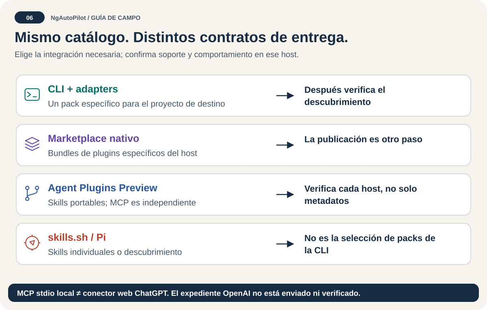

# Plan de release y distribución: 0.10.0

<!-- docs:navigation:start -->
[English](publication-plan.md) · [Mapa](README.es.md) · [Inicio](../README.es.md)

<!-- docs:navigation:end -->

**Construir → validar → aprobar → integrar → publicar → verificar.** Un release fuente completo no implica aceptación en todos los directorios ni actualización forzada de las instalaciones de usuarios.

## Un inventario; estados diferentes

El [registro de destinos](../config/publication-targets.json) incluye 21 superficies solicitadas. `npm run release:inventory` genera `dist/release/release-inventory.json`: IDs/rutas de todas las skills, packs, miembros e integridad npm, checksums de archivos, commit exacto y preparación por destino. `ngautopilot platform --json` ofrece el inventario general. Ninguno demuestra visibilidad remota.

Pi es un harness basado en npm. El módulo Python interno de Skill Lab no es un producto PyPI soportado. El inventario del release lista todos los archivos Python fuente/empaquetado rastreados, sus hashes y si están en npm; los gates auditan aparte su árbol de dependencias resuelto con pip-audit fijado sobre Python 3.12, sin builds fuente. Publicar en PyPI requeriría contrato, pruebas y decisión del propietario independientes; no se sube silenciosamente.

## P0 — Seguridad y primer release completo

- [ ] El HEAD de la PR supera seguridad fuente, npm audit, validadores de skills/frontmatter/distribución, pruebas de scripts/repositorio/Skill Lab, documentos bilingües, gráficos, deriva de generación, ZIP OpenAI y E2E del paquete.
- [ ] Revisar el expediente Sage del commit exacto y registrar aparte los resultados externos reales. Generarlo nunca equivale a aprobar.
- [ ] Obtener aprobación humana independiente de code owner y checks protegidos `validate-release` / `validate-skill-lab`. El único code owner actual es el autor y no puede aprobar su propia PR: hay que designar un revisor autorizado sin cambiar silenciosamente la propiedad. Integrar una PR sin eludir revisión. [Tareas activas](https://github.com/janpereira-dev/ngAutoPilot/issues/69).
- [ ] El propietario configura **RELEASE_NPM_TOKEN en release-security**. El 2026-10-01 la API de nombres no mostró secretos del entorno y el repositorio conservaba `NPM_TOKEN`. No copiar credenciales a archivos ni usar automáticamente ese token más amplio. Rotarlo/revocarlo cuando esté activa la ruta protegida. [Publicación confiable OIDC](https://docs.npmjs.com/trusted-publishers/) es la migración preferida posterior, previa configuración del propietario; no se presume existente.
- [ ] Crear tag anotado `v0.10.0` desde el main integrado y revisado; publicar el release GitHub. El evento dispara npm y todos los archivos, condicionado a aprobación protegida. Reintentar manualmente desde el mismo tag.
- [ ] Aprobar el deployment release-security después de revisar su expediente. Verificar versión/latest/integridad npm, adjuntos/checksums GitHub y resultado de Actions.

Un reintento acepta una versión npm existente solo con bytes idénticos. Bytes diferentes fallan y latest no puede retroceder. No se reemplazan versiones históricas ni personalizaciones. [Las reglas npm](https://docs.npmjs.com/cli/v11/commands/npm-publish/) exigen otra versión si cambia el contenido. Cada consumidor actualiza explícitamente; los indexadores pueden tardar.

## P1 — Codex primero: los tres gates pendientes

1. **Identidad y ficha:** seleccionar organización/proyecto OpenAI, verificar identidad editorial y contenido de ficha/icono. Website está declarado; la consulta web del 2026-10-01 no pudo verificar soporte/privacidad/términos. Comprobar acceso, contenido y propiedad. Las cuatro URLs son obligatorias para revisión pública de una app MCP adjunta, no una regla universal de paquetes solo con skills. [Requisitos oficiales](https://developers.openai.com/plugins/deploy/submission).
2. **Evidencia real del host:** instalar desde el marketplace del repositorio en un perfil Codex limpio, comprobar Components/Skills e invocar una skill con una tarea de bajo riesgo. Registrar host, tag, nombres, invocación y salida. Los tests locales de manifiesto/MCP no prueban esto. Repetir en Claude Code con su [procedimiento oficial](https://code.claude.com/docs/en/plugin-marketplaces).
3. **Envío, revisión y publicación pública:** validar/construir ZIP solo con skills; el propietario lo sube, declara políticas, envía, resuelve observaciones y publica. Registrar IDs de borrador/envío/aprobación/ficha por separado. No hacen falta casos MCP, demo ni credenciales de revisión para skills-only. Importar traducciones no garantiza todavía que aparezcan en la ficha pública. Añadir MCP después exige revisar sus restricciones.

No se inventan identidad, declaraciones legales, comercio ni países. El SVG y los checks locales son evidencia técnica, no aprobación del portal.

## P2 — Claude y Vercel skills.sh

- Claude: instalación GitHub, inventario de componentes e invocación `/plugin:skill`; el directorio oficial requiere envío separado. Tener marketplace propio no equivale a figurar en el de Anthropic.
- skills.sh: instalación real y autorizada `npx skills add janpereira-dev/ngAutoPilot`, conservando privacidad; comprobar ficha y auditorías con proveedor/fecha. [Usa telemetría de instalaciones](https://www.skills.sh/docs/faq), no una API de subida deducida de JSON. No generar instalaciones, rankings o dictámenes positivos artificiales. Separar corrección local y reindexación externa.
- AutoSkills, SkillsMP, SkillsLLM, LobeHub y MCPMarket: ya hay builders de expedientes fuente. Verificar ruta actual de cada operador, enviar/indexar y guardar URL aceptada; no asumir endpoint genérico ni que un bundle preparado esté enviado.

## P3 — OpenClaw, Hermes, Pi y OpenCode

- **ClawHub:** exportar skills revisadas a carpetas planas con slugs únicos propios. Su workflow recorre carpetas inmediatas; no enviar ciegamente nuestro árbol anidado. Revisar permisos/metadatos e identidad; simular `clawhub skill publish <skill-folder> --slug <owned-slug> --name <title> --version 0.10.0 --dry-run`, publicar solo selecciones revisadas y comprobar versión, scanner y moderación. [Quickstart](https://docs.openclaw.ai/clawhub/quickstart). Publicar skills no es publicar un plugin ejecutable OpenClaw, que requiere otros metadatos. Aquí no se configura ni utiliza token de ese registro.
- **Hermes:** exportación nativa en proyecto confiable y evidencia de listado/invocación. [Uso oficial](https://hermes-agent.nousresearch.com/docs/guides/work-with-skills). Incluirla como built-in u oficial requiere aceptación upstream.
- **Pi:** `pi install npm:ngautopilot@0.10.0`, `pi list` e invocación tras revisar confianza. `pi.skills`, prompts y keyword `pi-package` ya habilitan elegibilidad; [hay que verificar visibilidad en la galería](https://github.com/earendil-works/pi/blob/main/packages/coding-agent/docs/packages.md).
- **OpenCode:** exportar al layout documentado, comprobar descubrimiento e invocar. No confundirlo con otro producto OpenCodex sin verificar identidad.

Copilot, Cursor, Gemini y el adaptador genérico tienen regresiones de archivos; la ejecución real sigue siendo una tarea independiente, no un sello universal.

## P4 — Ecosistemas chinos sin inventar soporte

- **Alibaba Qwen Code:** añadir layout `.qwen/skills`, pruebas de nombres/recursos/conflictos y descubrimiento `/skills` e invocación real. [Contrato oficial](https://qwenlm.github.io/qwen-code-docs/en/users/features/skills/). Sin mover ni renombrar el catálogo.
- **Qoder:** añadir exportación `.qoder/skills` basada en fuente y prueba real. [CLI oficial](https://docs.qoder.com/cli/Skills). Importación ZIP local y aceptación pública son cosas distintas.
- **Z.ai / “ZI”:** confirmar identidad del destino antes de crear adaptador o afirmar marketplace. [Integración Claude Code](https://docs.z.ai/devpack/tool/claude) configura un proveedor de modelos; no demuestra registro propio de skills.
- Otros harnesses: añadir de uno en uno con nombre/fuente, alcance/confianza/precedencia, instalación, recursos, descubrimiento, invocación, actualización/desinstalación y propietario de publicación. Lo desconocido sigue desconocido.

## Evidencia para cerrar cada destino

Guardar versión/tag, versión host, instalación, componentes descubiertos, invocación/salida, URL/ID de ficha cuando corresponda, proveedor/estado/fecha de auditoría y aprobación del responsable. Separar fuente preparada, artefacto construido, instalado, verificado en host, enviado, aprobado y publicado. Cerrar únicamente el contrato comprobado de ese destino.
