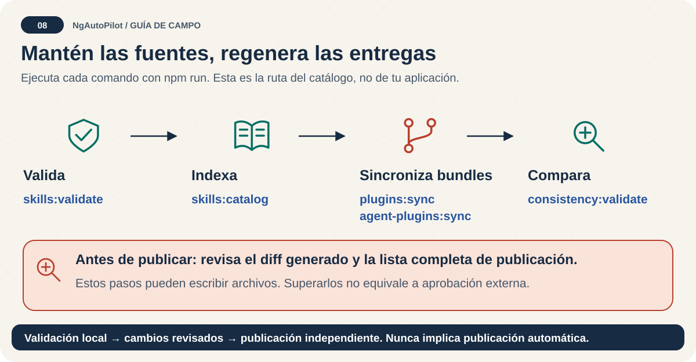

# Lista de publicación: evidencia local antes de distribuir 📦

<!-- docs:navigation:start -->
[English](release-checklist.md) · [Mapa](README.es.md) · [Inicio](../README.es.md)

<!-- docs:navigation:end -->



**Una comprobación local correcta prepara la publicación; no demuestra que esté publicada.** Usa esta lista en la rama elegida. Crear etiquetas, subir cambios y publicar requiere autorización del responsable; esta guía no lo ejecuta.

## 1. Confirma la entrada de publicación

- [ ] Rama y commit elegidos incluyen cambios revisados.
- [ ] El trabajo local ajeno está conservado.
- [ ] La versión de `package.json`, manifiestos y catálogo es deliberada.
- [ ] Las guías inglesas y españolas describen las mismas capacidades.
- [ ] El expediente de envío registra el estado externo real.

No restablezcas un checkout con cambios para que la lista aparezca correcta. Utiliza uno aislado cuando haga falta.

## 2. Valida y revisa los cambios generados

```bash
npm run docs:index
npm run docs:validate
npm run release:validate
npm run skills:publish:pack
npm run publish:validate
npm run agent-plugins:pack
npm pack --dry-run --json
```

`release:validate` es el control local amplio definido por `package.json` en esta rama. Valida fuentes, seguridad, distribución, catálogo, plugins nativos y portables, marketplaces, consistencia, versión y pruebas. Algunos pasos regeneran archivos o comprueban diferencias; revísalas y resuélvelas sin ocultarlas.

Para un cambio de catálogo, el orden básico es `skills:validate` → `skills:catalog` → `plugins:sync` → `agent-plugins:sync` → `consistency:validate`. Esas comprobaciones parciales no sustituyen el control completo de publicación.

Revisa la lista del paquete, no solo su código de salida:

- Deben aparecer CLI, soporte del instalador, MCP, fuentes, packs y adaptadores.
- Deben aparecer documentación pública inglesa/española y metadatos.
- No deben filtrarse `skill-lab/`, secretos, archivos temporales ni dependencias de desarrollo.
- Comprueba la forma del JSON: npm puede devolver una lista o un objeto por nombre de paquete.

## 3. Publica solo con autorización

El workflow protegido publica npm y archivos con `release.published` o reintento manual `publish=true` desde el tag exacto. El tag debe coincidir con package.json y el commit pertenecer a main. Sigue requiriendo aprobación humana. Consulta el [plan de publicación](publication-plan.es.md).

El workflow actual utiliza una credencial npm configurada; no afirmes que Trusted Publishing está activado sin revisar e implementar esa configuración por separado. No pegues tokens ni códigos de un solo uso en documentación, registros, incidencias o chats.

Si el responsable elige publicación manual npm, comprueba identidad con `npm whoami` y sigue el flujo autenticado del registro. Crea la etiqueta y publicación previstas una sola vez; revisa el estado remoto antes y no sobrescribas etiquetas existentes.

## 4. Verifica el resultado público

- [ ] npm muestra la versión exacta prevista.
- [ ] Etiqueta y publicación GitHub apuntan al commit correcto.
- [ ] Archivos y sumas de comprobación están adjuntos y coinciden.
- [ ] Un proyecto temporal limpio utiliza ese paquete publicado exacto.
- [ ] Las skills se descubren en cada cliente declarado verificado; los esquemas no bastan.
- [ ] Revisiones y aprobaciones exigidas están realmente satisfechas.
- [ ] El envío y declaración OpenAI siguen pendientes salvo confirmación externa real.

Ejecuta `help`, `doctor` e `install --dry-run` con un pack específico y versión publicada exacta en un proyecto temporal. No utilices `init`, obsoleto, ni instales todo el catálogo como prueba de publicación.

## 5. Registra el resultado

Separa **preparado**, **validado localmente**, **publicado** y **verificado en el cliente**. Incluye versión, commit, rutas y pasos externos pendientes. [Mantenimiento](maintainer-guide.es.md) · [Límites de publicación OpenAI](openai-marketplace-release.es.md).
