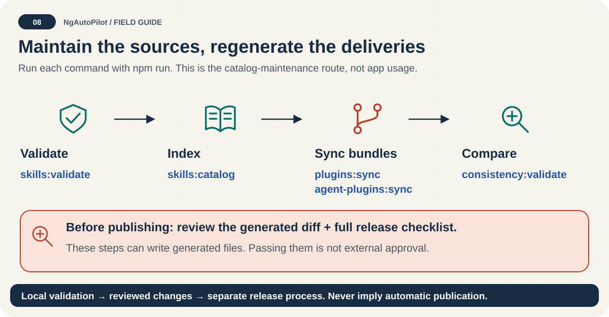

# Release checklist: local proof before public delivery 📦

<!-- docs:navigation:start -->
[Español](release-checklist.es.md) · [Map](README.md) · [Home](../README.md)

<!-- docs:navigation:end -->



**A green local check is preparation, not publication.** Use this checklist on the intended release branch. Tagging, pushing and publishing require release-owner authorization; this guide does not perform them.

## 1. Confirm the release input

- [ ] The intended branch/commit includes reviewed changes.
- [ ] Existing unrelated local work is preserved.
- [ ] The version in `package.json`, manifests and catalog is intentional.
- [ ] English and Spanish guides describe the same release capabilities.
- [ ] The versioned submission packet records its actual external status.

Do not reset a dirty checkout to make this list green. Use an isolated checkout when needed.

## 2. Validate and inspect generated differences

```bash
npm run docs:index
npm run docs:validate
npm run release:validate
npm run skills:publish:pack
npm run publish:validate
npm run agent-plugins:pack
npm pack --dry-run --json
```

`release:validate` is the broad local gate listed in this branch's `package.json`. It validates sources, security, distribution, catalog, native/portable plugins, marketplaces, consistency, release version and tests. Some steps regenerate files or check for drift; review and resolve the diff rather than hiding it.

For an individual catalog change, the core order is `skills:validate` → `skills:catalog` → `plugins:sync` → `agent-plugins:sync` → `consistency:validate`. These narrow checks do not replace the full release gate.

Inspect the tarball list, not just its exit code:

- CLI, installer support, MCP, source skills, packs and adapters must be present.
- English/Spanish public documentation and release metadata must be present.
- `skill-lab/`, local secrets, temporary files and development dependencies must not leak.
- Inspect the JSON shape: npm versions can return an array or an object keyed by package name.

## 3. Publish only with authorization

Use the project's approved release process. The current `.github/workflows/release.yml` builds artifacts on a published GitHub release event. **Its npm publish step runs only for `workflow_dispatch` with `publish=true`**, not merely because a release exists.

The current workflow uses a configured npm credential; do not claim Trusted Publishing is enabled without reviewing and implementing that separate configuration. Never paste tokens or one-time codes into docs, logs, issues, or chat.

If the owner chooses manual npm publication, check identity with `npm whoami`, then follow the registry's authenticated publish flow. Create the intended version tag and GitHub release only once; inspect remote state first and never overwrite an existing release tag.

## 4. Verify the public result

- [ ] npm reports the intended exact version.
- [ ] The GitHub tag and release point to the intended commit.
- [ ] Release archives and checksums are attached and match.
- [ ] A clean temporary receiving project can use that exact published package.
- [ ] Skills are discovered by each host claimed as verified; schema validation is not enough.
- [ ] Review and approval requirements are actually satisfied.
- [ ] OpenAI submission/attestation remains pending unless there is real external confirmation.

Run `help`, `doctor`, and a focused `install --dry-run` from the exact published version in a temporary project. Do not use the deprecated `init` or install a full catalog as a publication smoke test.

## 5. Record the outcome

Report **prepared**, **locally validated**, **published**, and **host verified** separately. Include version, commit, artifact paths and unresolved external steps. [Maintainer guide](maintainer-guide.md) · [OpenAI release boundary](openai-marketplace-release.md).
