# Solución de problemas: encuentra la capa que falla 🔧

<!-- docs:navigation:start -->
[English](troubleshooting.md) · [Mapa](README.es.md) · [Inicio](../README.es.md)

<!-- docs:navigation:end -->



Empieza por el comando exacto, la versión instalada, el agente, el ámbito y el error. No ocultes un conflicto añadiendo `--force`.

## Diagnóstico rápido

| Síntoma | Primera comprobación | Siguiente acción segura |
| --- | --- | --- |
| Comando no encontrado | CLI global, local o puntual | Utilizar `npm exec` o el ejecutable local correspondiente |
| Node no compatible | Requisitos del paquete instalado | Usar un entorno compatible sin cambiar dependencias a ciegas |
| No hay archivos después de instalar | Aprobación o `--dry-run` | Revisar el plan y utilizar `--yes` |
| Agente o pack desconocido | Salida de `adapters` y `packs` | Copiar un identificador listado |
| Ámbito de usuario no admitido | Ámbitos del adaptador | Usar proyecto o un adaptador compatible |
| Verificación con diferencias | Archivos gestionados editados | Crear copia y comparar antes de sobrescribir |
| Archivos ausentes | Rutas del manifiesto | Revisar una reinstalación con la misma selección |
| El agente no encuentra skills | Destino y descubrimiento del cliente | Comprobar rutas y recargar según el cliente |
| Migración bloqueada | Punto de control y evidencia | Resolver el control real; `resume` no lo omite |

## La instalación no escribió

`--dry-run` nunca escribe. Una operación que requiere aprobación sin `--yes` informa de ese requisito. Los ejemplos antiguos de `init` están obsoletos; utiliza:

```bash
ngautopilot install --agent codex --pack ngautopilot-core --scope project --dry-run
```

Después de revisar el plan, repite con `--yes` en lugar de `--dry-run`.

## Avisos de verificación o desinstalación

`verify` compara archivos con el manifiesto, no ejecuta las pruebas de la aplicación. Los archivos ausentes y los contenidos editados son problemas distintos. Crea una copia antes de reinstalar o actualizar: esta rama puede actualizar archivos gestionados seleccionados aunque estén editados.

La desinstalación rechaza archivos gestionados modificados salvo que se fuerce. Consérvalos, copia las modificaciones a otro lugar o elimínalos deliberadamente con `--yes --force` después de respaldarlos. [Actualización](updating.es.md) · [Desinstalación](uninstalling.es.md).

## Descubrimiento Codex y MCP

Skills del proyecto: `.agents/skills/`; instrucciones: `AGENTS.md` raíz. Skills de usuario: `~/.agents/skills/`; instrucciones: `~/.codex/AGENTS.md`. Este instalador no utiliza `.codex/skills/` como destino.

El registro MCP es independiente. Instalar un pack no registra el servidor. [Registro MCP](mcp-and-chatgpt.es.md#registro-en-la-cli-de-codex).

## Fallos de consistencia para mantenimiento

Lee el resultado: las causas pueden ser recuentos distintos, cobertura de bundles ausente, manifiestos inválidos, skills en borrador o textos de plantilla. Para cambios de fuentes:

```bash
npm run skills:catalog
npm run plugins:sync
npm run agent-plugins:sync
npm run consistency:validate
```

Revisa los cambios generados. No edites las copias manualmente.

## Hooks en Windows

El hook previo al commit es Bash y requiere Git Bash. `npm run hooks:install` configura la ruta de hooks de Git; **no convierte el hook en Node.js**. Si falta ese entorno, ejecuta las validaciones manualmente e indica la limitación. [Guía multiplataforma](cross-platform.es.md).

## Errores de stop hook

NgAutoPilot no incluye un stop hook. Revisa la configuración y los registros del cliente antes de atribuir un error JSON al paquete. No elimines configuraciones globales ni expongas tokens durante el diagnóstico.

**Si continúa el problema:** comparte comando, versión, ámbito y error saneados; no credenciales ni archivos privados.
