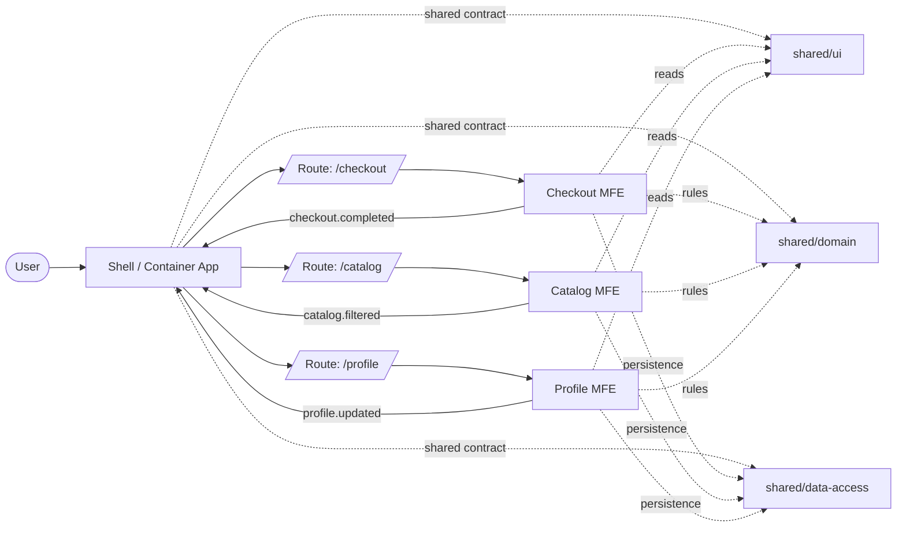

# Micro-frontends Architecture

## Purpose

Use this skill to evaluate, design, or review Micro-frontends architectures for large frontend applications, especially in Angular and Nx monorepos.

Micro-frontends are an organizational architecture with technical consequences. They are useful only when team boundaries, domain boundaries, release independence, and delivery maturity justify the added complexity.

The core rule is simple:

```txt
If there is no real organizational independence, you probably do not need Micro-frontends.
You need better modular architecture.
```

## When to Use

Use this skill when:

- an application is large and split across multiple teams
- independent deployment is a real requirement
- a shell or container app is being proposed
- Module Federation, Native Federation, or iframe composition is under evaluation
- the repo is moving from a monolithic frontend to distributed feature ownership
- shared libraries, design systems, and integration contracts need architectural review
- Nx monorepo boundaries are drifting toward cross-domain coupling

## When Not to Use

Do not use this skill when:

- the application is small or maintained by one team
- the real issue is poor modularization inside one frontend
- lazy loading and feature libraries are sufficient
- there is no operational need for independent deployment
- the team does not have mature CI/CD, ownership, and E2E coverage
- the request is only about a shared library or design system

## Do

Evaluate the organization before the technology:

```txt
Teams -> Domains -> Ownership -> Delivery model -> Integration pattern
```

Keep business domains as the unit of decomposition:

```txt
Checkout
Catalog
Profile
Analytics
Billing
Claims
```

Keep the shell thin:

```txt
Shell responsibilities:
- routing
- composition
- layout
- authentication cross-cutting concerns
- error handling for remote loading
- shared navigation contracts
```

Document each MFE contract explicitly:

```txt
Name:
Domain:
Owner:
Route base:
Load mode:
Shared dependencies:
Inputs:
Outputs:
Events emitted:
Events consumed:
Fallback:
Versioning strategy:
Tests:
```

Prefer the simplest integration pattern that satisfies the delivery model:

```txt
1. Modular monolith with lazy loading
2. Build-time integration
3. Module Federation or Native Federation
4. iframe for strong isolation or legacy integration
```

Use shared libraries only for genuinely reusable contracts:

```txt
shared/ui
shared/domain
shared/data-access
shared/util
design-system
```



## Do Not

Avoid decomposing by visual components:

```txt
Header
Button
Modal
Table
Footer
```

Avoid a shell that owns business rules from remotes.

Avoid shared libraries that inject domain services, stores, or routing decisions.

Avoid runtime federation without versioning, fallback, and smoke tests.

Avoid pretending distributed code is independent when all modules share one release train and one owner.

## Review Checklist

- [ ] There is a real organizational reason for Micro-frontends.
- [ ] Domains, not UI pieces, define boundaries.
- [ ] Each MFE has an owner and a contract.
- [ ] The shell stays thin and orchestration-only.
- [ ] Shared libraries are truly reusable and domain-agnostic.
- [ ] A clear integration pattern is chosen intentionally.
- [ ] CI/CD and E2E coverage exist for each integration boundary.
- [ ] Fallback behavior is defined for failed remote loading.
- [ ] Nx boundaries and tags support the intended architecture.
- [ ] The chosen architecture is simpler than the alternatives it replaces.

## Expected Output

When this skill is used, the agent should:

1. Classify whether Micro-frontends are warranted.
2. Identify domain boundaries, ownership, and delivery constraints.
3. Recommend the simplest viable integration pattern.
4. Define shell, remote, and shared library contracts.
5. Call out operational risks, testing gaps, and fallback requirements.
